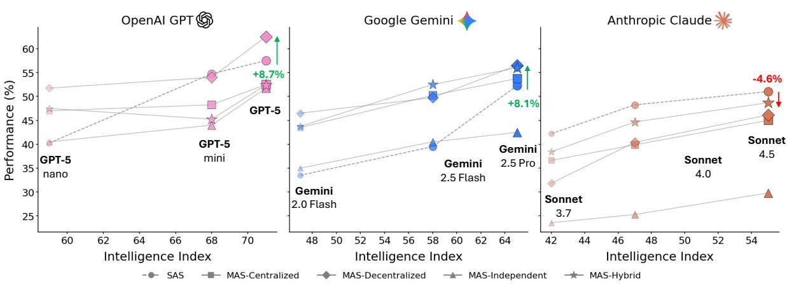
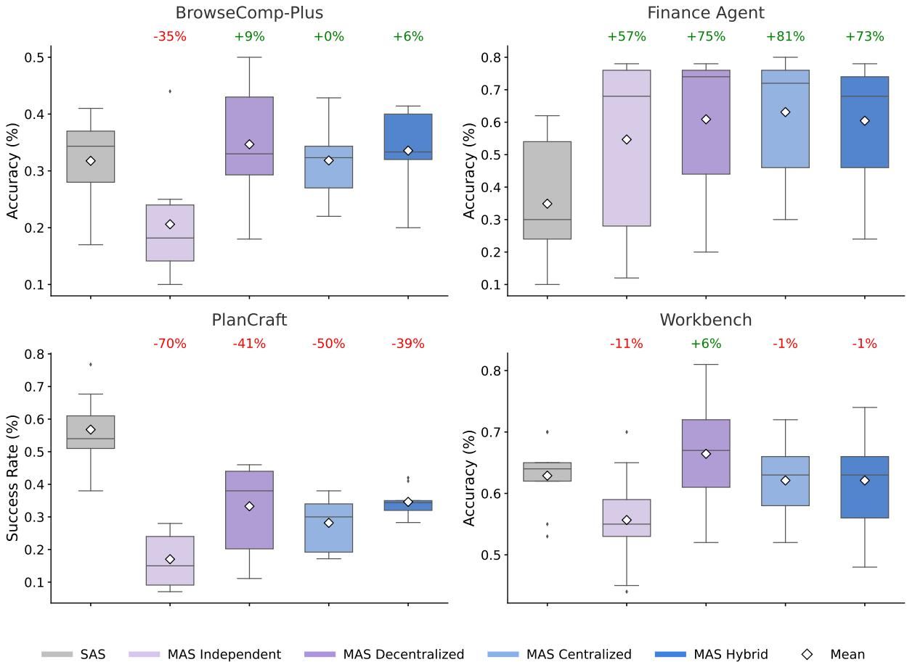
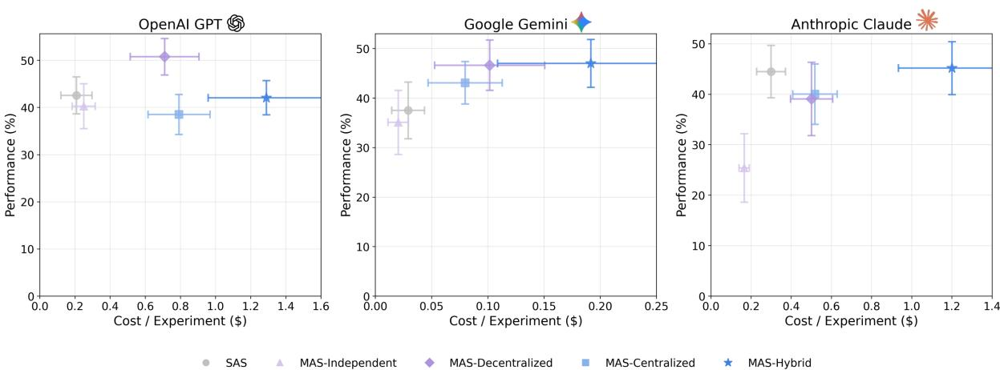
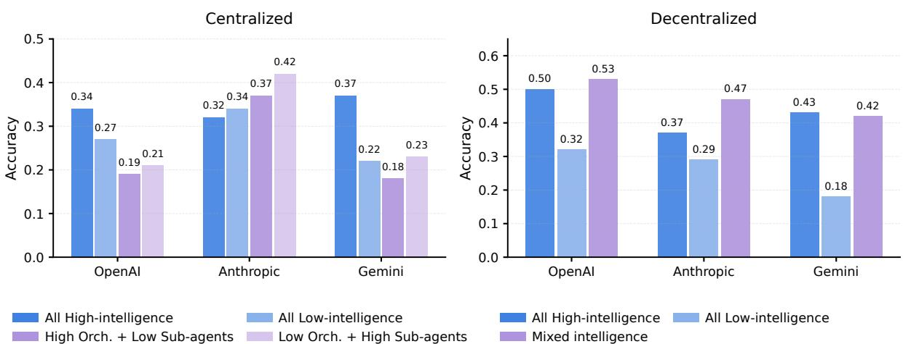
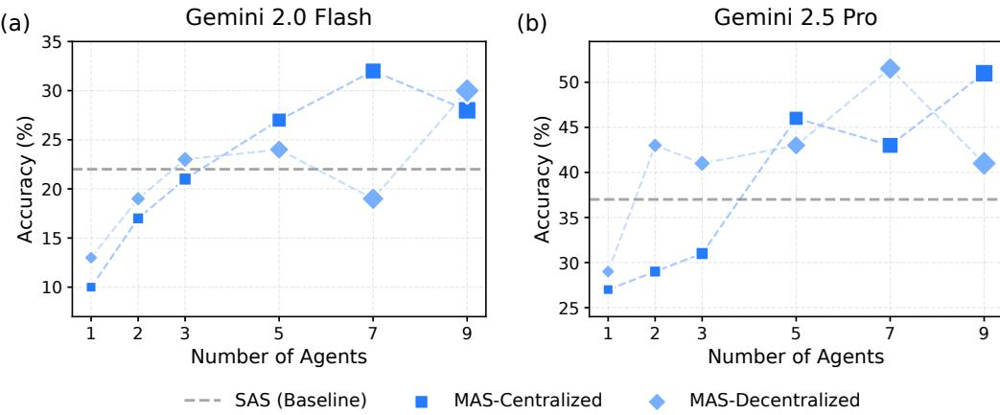
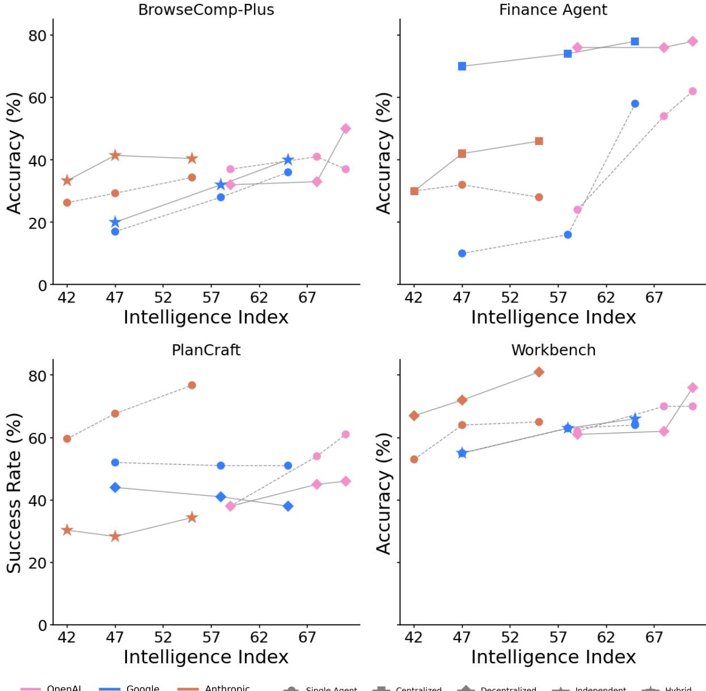

# **Towards a Science of Scaling Agent Systems**

**Yubin Kim**1,3,† **, Ken Gu**1 **, Chanwoo Park**3 **, Chunjong Park**2 **, Samuel Schmidgall**2 **, A. Ali Heydari**1 **, Yao Yan**1 **, Zhihan Zhang**1 **, Yuchen Zhuang**2 **, Yun Liu**1 **, Mark Malhotra**1 **, Paul Pu Liang**3 **, Hae Won Park**3 **, Yuzhe Yang**1 **, Xuhai Xu**1 **, Yilun Du**1 **, Shwetak Patel**1 **, Tim Althoff**1 **, Daniel McDuff**1 **and Xin Liu**1,†

1Google Research, 2Google DeepMind, 3Massachusetts Institute of Technology, †Corresponding Author

*Agents***, language model (LM)-based systems that are capable of reasoning, planning, and acting are becoming the dominant paradigm for real-world AI applications. Despite this widespread adoption, the principles that determine their performance remain underexplored, leaving practitioners to rely on heuristics rather than principled design choices. We address this gap by deriving quantitative** *scaling principles* **for agent systems. We first formalize a definition for agentic evaluation and characterize scaling laws as the interplay between agent quantity, coordination structure, model capability, and task properties. We evaluate this across four diverse benchmarks: Finance-Agent, BrowseComp-Plus, PlanCraft, and Workbench, spanning financial reasoning, web navigation, game planning, and workflow execution. Using five canonical agent architectures (Single-Agent System and four Multi-Agent Systems: Independent, Centralized, Decentralized, Hybrid), instantiated across three LLM families, we perform a controlled evaluation spanning 180 configurations, standardizing tools, prompt structures, and token budgets to isolate architectural effects from implementation confounds. We derive a predictive model using empirical coordination metrics, including efficiency, overhead, error amplification, and redundancy, that achieves cross-validated** 2=0.524**, enabling prediction on unseen task domains by modeling task properties rather than overfitting to a specific dataset. We identify three dominant effects: (1) a** *tool-coordination trade-off***: under fixed computational budgets, tool-heavy tasks suffer disproportionately from multi-agent overhead. (2) a** *capability saturation***: we observe that coordination yields diminishing or negative returns (**ˆ=−0.404**,** <0.001**) once single-agent baselines exceed an empirical threshold of** ∼45%**. (3)** *topology-dependent error amplification***: independent agents amplify errors** 17.2× **through unchecked propagation, while centralized coordination contains this to** 4.4×**. Crucially, coordination benefits are task-contingent. Centralized coordination improves performance by** 80.8% **on parallelizable tasks like financial reasoning, while decentralized coordination excels on dynamic web navigation (**+9.2% **vs.** +0.2%**). Yet for sequential reasoning tasks, every multi-agent variant we tested degraded performance by** 39**–**70%**. The framework predicts the optimal coordination strategy for 87% of held-out configurations. Out-of-sample validation on GPT-5.2, released after our study, achieves MAE=0.071 and confirms four of five scaling principles generalize to unseen frontier models, providing a quantitatively predictive framework for** *agentic scaling* **based on measurable task properties.**

### **1. Introduction**

*Agents* [(Wang et al.,](#page-27-0) [2024a)](#page-27-0), language model-driven systems that operate through iterative cycles of reasoning, planning, and acting, adapting their behavior based on environmental or tool-generated feedback, have achieved remarkable performance in diverse applications, from code generation [(Yang et al.,](#page-28-0) [2024;](#page-28-0) [Zhang et al.,](#page-28-1) [2024)](#page-28-1), web browsing [(Wei et al.,](#page-28-2) [2025;](#page-28-2) [Yao et al.,](#page-28-3) [2022)](#page-28-3), medical decision-making [(Heydari et al.,](#page-26-0) [2025;](#page-26-0) [Kim et al.,](#page-26-1) [2024;](#page-26-1) [McDuff et al.,](#page-26-2) [2025)](#page-26-2), finance [(Yu et al.,](#page-28-4) [2025)](#page-28-4), sustainability [(Zhang et al.,](#page-29-0) [2025b)](#page-29-0), to scientific discovery [(Gottweis et al.,](#page-26-3) [2025;](#page-26-3) [Mitchener](#page-27-1) [et al.,](#page-27-1) [2025)](#page-27-1). As tasks grow in complexity and require sustained environmental interaction, the field has increasingly turned to multi-agent systems (MAS), relying on the premise that specialized

*Corresponding author(s): ybkim95@mit.edu, xliucs@google.com* © 2025 Google. All rights reserved



Figure 1 | **Agent Scaling across model intelligence and system architectures.** Average performance (%) across four agentic benchmarks improves consistently with increasing model *Intelligence Index* (see Appendix [A)](#page-30-0) across three major LLM families (OpenAI, Google, and Anthropic) under different agent configurations. Single Agent System (**SAS**) serves as reference trajectories, while Multi Agent System (**MAS**) variants (Centralized, Decentralized, Independent, and Hybrid) reveal distinct scaling behaviors (see Table [2](#page-9-0) for architecture comparisons). All percentage deltas annotated in the figure (e.g., +8.7%, +8.1%, –4.6%) indicate relative performance change of the best-performing MAS variant compared to the SAS baseline at the same Intelligence Index. Centralized and hybrid coordination generally yield superior scaling efficiency, suggesting that collaborative agentic structures amplify capability gains more effectively than individual scaling alone.

collaboration consistently outperforms single-agent systems (SAS) [(Guo et al.,](#page-26-4) [2024;](#page-26-4) [Tran et al.,](#page-27-2) [2025)](#page-27-2). Previous work has made positive claims about multi-agent systems: "*More agents is all you need*" [(Li](#page-26-5) [et al.,](#page-26-5) [2024)](#page-26-5), suggesting that agent collaboration follows *collaborative scaling principles* [(Qian et al.,](#page-27-3) [2025)](#page-27-3), and that MAS consistently outperforms single-agent systems (SAS) on complex tasks [(Chen](#page-25-0) [et al.,](#page-25-0) [2024b;](#page-25-0) [Du et al.,](#page-25-1) [2023)](#page-25-1). Yet, despite rapid adoption, there remains no principled quantitative framework to predict when adding agents amplifies performance and when it erodes it. This gap leaves practitioners relying on heuristics, hindering both the emergence of a science of agent systems and, critically for real-world deployment, the ability to determine when multi-agent coordination provides genuine value over simpler single-agent alternatives.

To determine when multi-agent coordination provides benefit, we first establish which task categories require agentic capabilities. A critical prerequisite is distinguishing between *agentic* and *non-agentic* evaluation paradigms. Expanding from the Agentic Benchmark Checklist (ABC) introduced in [(Zhu et al.,](#page-29-1) [2025)](#page-29-1), we characterize *agentic tasks* as those requiring: (i) sustained multistep interactions with an external environment, (ii) iterative information gathering under partial observability, and (iii) adaptive strategy refinement based on environmental feedback.

These characteristics differentiate tasks like web browsing [(Wei et al.,](#page-28-2) [2025)](#page-28-2), financial trading [(Yu](#page-28-4) [et al.,](#page-28-4) [2025)](#page-28-4), software engineering [(Jimenez et al.,](#page-26-6) [2024)](#page-26-6), and interactive planning [(Dagan et al.,](#page-25-2) [2024)](#page-25-2) from traditional static benchmarks, tasks solvable through single-shot reasoning without environmental feedback, which lack external environments, are fully observed, or require identical solution strategies [(Kapoor et al.,](#page-26-7) [2025;](#page-26-7) [Liu et al.,](#page-26-8) [2024)](#page-26-8). This distinction matters profoundly because, while recent agentic benchmarks have emerged (e.g., SWE-Bench [(Jimenez et al.,](#page-26-6) [2024)](#page-26-6), 2 -Bench [(Barres](#page-25-3) [et al.,](#page-25-3) [2025)](#page-25-3), TerminalBench), *multi-agent system evaluations* have been conducted predominantly on non-agentic tasks, potentially providing misleading guidance about when collaboration provides value. This distinction is practically consequential: while LLMs achieve high accuracy on isolated

code generation tasks like HumanEval [(Chen et al.,](#page-25-4) [2021)](#page-25-4), real-world deployment requires agentic capabilities—iterative debugging, repository navigation, and adaptive strategy refinement—as exemplified by interactive coding assistants (e.g., Cursor, Copilot Workspace). Multi-agent systems that show monotonic improvement with team size on static benchmarks (reaching 89% on HumanEval with five agents) exhibit fundamentally different scaling behavior when evaluated on tasks requiring sustained environmental interaction, where coordination overhead and error propagation dynamics dominate.

Fundamentally, this distinction reflects a trade-off between context integration and diversity [(Du](#page-25-1) [et al.,](#page-25-1) [2023;](#page-25-1) [Hong et al.,](#page-26-9) [2024)](#page-26-9). Single-agent systems maximize context integration by maintaining a unified memory stream in which all reasoning steps share full access to prior history, enabling effectively constant-time access to global context. In contrast, multi-agent systems impose intrinsic information fragmentation [(Tran et al.,](#page-27-2) [2025)](#page-27-2): while parallel agents enable diverse exploration, they incur an unavoidable *coordination tax* in which the global context must be compressed into inter-agent messages. This lossy communication increases synchronization overhead and cognitive load (**?**), fundamentally altering the scaling behavior of collaboration.

The underlying dynamics explain this discrepancy: on agentic tasks, coordination overhead scales with interaction depth, agents operate on progressively divergent world states, and errors cascade through execution chains rather than being corrected through voting. Recent work has identified cases where single strong models match or exceed multi-agent systems [(Gao et al.,](#page-26-10) [2025)](#page-26-10), yet the evaluation literature provides limited guidance on *what factors* determine collaborative success, whether semantic diversity predicts team performance, how architectural choices shape coordination costs, or whether agents can detect and correct failures in extended interactions.

The problem is further compounded by rapid progress in frontier model capabilities. As base LLMs gain extended context windows, sophisticated tool use, and improved self-reflection, the unique value proposition of multi-agent collaboration becomes unclear. The answer likely depends on task characteristics and architectural choices that remain to be systematically quantified.

Two fundamental challenges hinder progress toward principled multi-agent design. **First**, existing MAS evaluations compare architectures using different prompts, tools, or computational budgets, conflating architectural effects with implementation choices and precluding clean causal attribution. **Second**, evaluations focus exclusively on final accuracy metrics without examining process dynamics such as coordination overhead, error propagation, and information flow that determine whether collaboration succeeds or fails. We know from human team performance [(Lencioni,](#page-26-11) [2002;](#page-26-11) [McGrath,](#page-27-4) [1964)](#page-27-4) that team effectiveness depends on composition, coordination mechanisms, and member differentiation. Yet we lack comparable empirical understanding of how these principles translate to artificial agents, leaving practitioners without quantitative guidance for architecture selection.

To address these challenges, we present a controlled evaluation establishing the principles for agent coordination. Our experimental design isolates architectural effects by controlling for implementation confounds which maintains identical task prompts, tools, and computational budgets across all configurations, while systematically varying only coordination structure and model capability. We evaluate five canonical architectures: Single Agent System (SAS) and four Multi-Agent variants (Independent, Centralized, Decentralized, Hybrid) instantiated across three major LLM families (OpenAI, Google, Anthropic) spanning diverse capability levels, on four representative agentic benchmarks: (1) web browsing (BrowseComp-Plus [(Chen et al.,](#page-25-5) [2025)](#page-25-5)), (2) financial analysis (Finance-Agent [(Bigeard](#page-25-6) [et al.,](#page-25-6) [2025)](#page-25-6)), (3) game planning (PlanCraft [(Dagan et al.,](#page-25-2) [2024)](#page-25-2)), and (4) realistic workplace tasks (Workbench [(Styles et al.,](#page-27-5) [2024)](#page-27-5)). Across =180 controlled configurations with matched token budgets, we derive a scaling principle across tested domains quantifying how performance emerges from empirically measured coordination properties.

In contrast to prior claims that "*more agents is all you need*", our evaluation reveals that the effectiveness of multi-agent systems is governed by quantifiable trade-offs between architectural properties and task characteristics. We establish a predictive framework using empirical coordination metrics: efficiency (success/overhead ratio), error amplification factors, message density and redundancy, achieving cross-validated 2=0.524 (explaining more than half of the performance variance on held-out data) without dataset-specific parameters. Critically, this framework generalizes beyond training configurations: the model correctly predicts optimal architectures for 87% of held-out task configurations, demonstrating extrapolation to unseen task structures.

Our analysis identifies three patterns. First, a *tool-coordination trade-off* (=−0.267, <0.001): tool-heavy tasks (e.g., 16-tool software engineering) suffer from multi-agent coordination overhead, with efficiency penalties compounding as environmental complexity increases. Second, a *capability ceiling* (=−0.404, <0.001): tasks where single-agent performance already exceeds 45% accuracy experience negative returns from additional agents, as coordination costs exceed diminishing improvement potential. Third, we observe *architecture-dependent error amplification*. Independent systems amplify errors 17.2× through *unchecked error propagation*, where individual mistakes cascade to the final output. Centralized coordination, however, contains this to 4.4× by enforcing *validation bottlenecks* that intercept errors before aggregation. Performance spans +81% relative improvement (structured financial reasoning under centralized coordination) to −70% degradation (sequential planning under independent coordination), demonstrating that architecture-task alignment, not number of agents, determines collaborative success. Importantly, optimal architectures vary systematically: decentralized coordination benefits tasks requiring parallel exploration of high-entropy search spaces (dynamic web navigation: +9.2%), while all multi-agent variants universally degrade performance on tasks requiring sequential constraint satisfaction (planning: −39% to −70%), where coordination overhead fragments reasoning capacity under fixed computational budgets. We synthesize these findings into quantitative architecture selection rules (Section [4.3)](#page-14-0) achieving 87% prediction accuracy on held-out configurations. The underlying mechanisms driving these patterns are interpretable: the tool-coordination trade-off arises because multi-agent systems fragment the per-agent token budget, leaving insufficient capacity for complex tool orchestration; the capability ceiling reflects that coordination overhead becomes a net cost when baseline performance is already high; and architecture-dependent error amplification stems from the presence or absence of validation bottlenecks that catch errors before propagation. These mechanistic insights enable practitioners to move from architectural heuristics to principled, measurement-driven deployment decisions.

Our primary contributions are:

- **Formalization of Agentic Evaluation rigor:** We redefine rigorous agentic assessment by distinguishing it from static reasoning tasks (e.g., MMLU). We establish that valid agentic evaluation requires three necessary conditions: sustained multi-step environment interaction, iterative information gathering under partial observability, and adaptive strategy refinement based on feedback.
- **Controlled evaluation of agent systems:** We establish a framework for comparing agent architectures, controlling for implementation confounds to isolate the effects of coordination structure. Our framework spans 180 configurations across three LLM families and four diverse benchmarks, enabling the causal attribution of performance differences to architectural choices rather than stochastic variations.
- **Intelligence-Coordination alignment:** We characterize the non-linear relationship between foundational model capabilities and agentic performance. We demonstrate that while higher capability (Intelligence Index) offers accelerating returns, these gains are not automatic; they strictly depend on architectural alignment. Without correct coordination structures, foundational improvements are often negated by coordination overhead.

- **Quantitative scaling principles and architecture alignment:** We derive a mixed-effects model ( 2=0.524) using empirical coordination metrics—efficiency (), error amplification (), and redundancy () to quantify how performance emerges from the interplay of reasoning capability and task properties. This framework identifies fundamental limits on coordination, specifically a *tool-coordination trade-off* (=−0.267) where tool-heavy workflows suffer from coordination tax, and safety bounds where centralized verification reduces error amplification from 17.2× to 4.4×. Leveraging these mechanisms, we demonstrate that architecture selection is governed by measurable task features (e.g., decomposability) rather than simple agent scaling, achieving 87% accuracy in predicting optimal architectures on held-out tasks.
## **2. Related Work**

**Multi-Agent Systems (MAS) versus Single-Agent Systems (SAS)** Understanding the difference between single-agent and multi-agent systems remains foundational to characterizing architectural effects. Following [Tran et al.](#page-27-2) [(2025)](#page-27-2) and [Guo et al.](#page-26-4) [(2024)](#page-26-4), we define a **Single-Agent System** as one that features a solitary reasoning locus: all perception, planning, and action occur within a single sequential loop controlled by one LLM instance, even when employing tool use [(Yao et al.,](#page-28-5) [2023)](#page-28-5), self-reflection [(Shinn et al.,](#page-27-6) [2023)](#page-27-6), or chain-of-thought (CoT) reasoning [(Wei et al.,](#page-28-6) [2022)](#page-28-6). Critically, self-reflection mechanisms do not constitute multi-agent collaboration, as they operate within a single decision-making locus [(Weng,](#page-28-7) [2023)](#page-28-7). A **Multi-Agent System** comprises multiple LLM-backed agents communicating through structured message passing, shared memory, or orchestrated protocols [(Xi](#page-28-8) [et al.,](#page-28-8) [2025)](#page-28-8). MAS architectures vary by topology: *Independent* systems aggregate isolated outputs; *Decentralized* enable peer-to-peer exchange [(Du et al.,](#page-25-1) [2023)](#page-25-1); *Centralized* route through orchestrators [(Hong et al.,](#page-26-9) [2024)](#page-26-9); *Hybrid* combine hierarchical control with lateral communication [(Dang et al.,](#page-25-7) [2025)](#page-25-7). MAS evaluation has moved beyond early assumptions of uniform superiority [(Li et al.,](#page-26-5) [2024;](#page-26-5) [Qian et al.,](#page-27-3) [2025)](#page-27-3) towards a nuanced understanding driven by domain complexity. Comprehensive surveys characterize collaboration mechanisms across coordination protocols [(Tran et al.,](#page-27-2) [2025)](#page-27-2) and agent profiling patterns [(Guo et al.,](#page-26-4) [2024)](#page-26-4). However, there exist empirical challenges: [Gao et al.](#page-26-10) [(2025)](#page-26-10) show benefits diminish as base models improve, with frontier models often outperforming teams; [Cemri et al.](#page-25-8) [(2025)](#page-25-8) identify 14 failure modes (Cohen's Kappa=0.88); [Zhang et al.](#page-28-9) [(2025a)](#page-28-9) achieve comparable performance at 6-45% cost through dynamic architecture search; and [Anthropic](#page-25-9) [(2024)](#page-25-9) report agents consume 15× more tokens. Theoretical foundations from [Sumers et al.](#page-27-7) [(2023)](#page-27-7) propose cognitive architectures contextualizing agents within AI's broader history. The question of *when* multi-agent coordination provides value over single strong models with tool use remains empirically open, with [Qian et al.](#page-27-3) [(2025)](#page-27-3)'s proposed scaling laws showing no significant universal pattern [(Wang et al.,](#page-27-0) [2024a)](#page-27-0), motivating our systematic evaluation.

**Agentic Tasks and Benchmarks** We define *agentic tasks* following [Zhu et al.](#page-29-1) [(2025)](#page-29-1) as requiring: (1) sustained multi-step environment interactions, (2) iterative information gathering under partial observability, and (3) adaptive strategy refinement from feedback—differentiating tasks like web browsing [(Wei et al.,](#page-28-2) [2025;](#page-28-2) [Zhou et al.,](#page-29-2) [2024)](#page-29-2), financial trading [(Bigeard et al.,](#page-25-6) [2025)](#page-25-6), software engineering [(Jimenez et al.,](#page-26-6) [2024)](#page-26-6), and planning [(Dagan et al.,](#page-25-2) [2024)](#page-25-2) from static benchmarks. *Non-agentic tasks* evaluate single-shot inference without environmental interaction: GSM8K [(Cobbe](#page-25-10) [et al.,](#page-25-10) [2021)](#page-25-10) (direct chain-of-thought math), MMLU [(Hendrycks et al.,](#page-26-12) [2021)](#page-26-12) (parametric knowledge), HumanEval [(Chen et al.,](#page-25-4) [2021)](#page-25-4) (specification-complete coding), and SQuAD [(Rajpurkar et al.,](#page-27-8) [2016)](#page-27-8) (single-pass comprehension). On non-agentic benchmarks, multi-agent systems show monotonic improvement through ensemble effects (89% on HumanEval with five agents), as voting corrects errors without sequential compounding [(Kapoor et al.,](#page-26-7) [2025)](#page-26-7). This distinction matters profoundly: in agentic

settings, coordination overhead scales with interaction depth, agents operate on divergent world states (34% overlap after 10 interactions), and errors cascade rather than cancel [(Kapoor et al.,](#page-26-7) [2025)](#page-26-7). [Zhu et al.](#page-29-1) [(2025)](#page-29-1) introduce the Agentic Benchmark Checklist addressing flaws causing 100% relative misestimation. Evolution spans [Liu et al.](#page-26-8) [(2024)](#page-26-8)'s 8-environment evaluation (4k-13k responses) to specialized frameworks: [Jimenez et al.](#page-26-6) [(2024)](#page-26-6) (GitHub resolution), [Zhou et al.](#page-29-2) [(2024)](#page-29-2) (812 web tasks), [Xu et al.](#page-28-10) [(2025)](#page-28-10) (30% autonomous completion), and [Paglieri et al.](#page-27-9) [(2025)](#page-27-9) (vision-based RL). [Yao et al.](#page-28-5) [(2023)](#page-28-5) formalizes reasoning-acting synergy; [Weng](#page-28-7) [(2023)](#page-28-7) characterizes agents requiring planning, memory, and tools; [Kapoor et al.](#page-26-7) [(2025)](#page-26-7) reveals narrow accuracy focus without cost metrics yields needlessly complex agents. Tasks showing MAS advantages in single-shot settings often exhibit opposite patterns under genuine interaction, indicating architectural benefits are task-contingent, motivating our isolation of coordination effects across diverse agentic domains.

**Scaling Laws and Coordination Mechanisms** Understanding performance scaling in multi-agent systems requires distinguishing collaborative scaling from neural scaling laws. While neural scaling follows power laws requiring million-fold parameter increases for significant trends [(Kaplan et al.,](#page-26-13) [2020)](#page-26-13), collaborative scaling exhibits logistic growth patterns emerging at substantially smaller scales [(Qian et al.,](#page-27-3) [2025)](#page-27-3). [Chen et al.](#page-25-11) [(2024a)](#page-25-11) explore whether increased LLM calls alone drive performance, finding compound inference systems follow distinct scaling behaviors from single-model training. However, [Wang et al.](#page-27-0) [(2024a)](#page-27-0) note collaborative scaling shows no significant universal pattern, suggesting domain-specific rather than general laws. Coordination mechanisms critically determine whether collaboration amplifies or degrades performance: [Hong et al.](#page-26-9) [(2024)](#page-26-9) introduce meta-programming workflows mitigating hallucination cascades; [Chen et al.](#page-25-0) [(2024b)](#page-25-0) demonstrate emergent behaviors through structured interactions; [Wu et al.](#page-28-11) [(2024)](#page-28-11) provide general multi-agent frameworks. Recent work reveals architecture-task alignment matters more than team size: [Zhang](#page-28-9) [et al.](#page-28-9) [(2025a)](#page-28-9) achieve superior performance at 6-45% cost through query-dependent configurations; [Dang et al.](#page-25-7) [(2025)](#page-25-7) show puppeteer orchestration improvements stem from compact cyclic structures; [Du et al.](#page-25-1) [(2023)](#page-25-1) demonstrate peer-to-peer debate effectiveness depends on task decomposability, with [Smit et al.](#page-27-10) [(2023)](#page-27-10) further showing that multi-agent debate does not reliably outperform single-agent strategies such as self-consistency, suggesting benefits are highly task- and hyperparameter-sensitive. These findings collectively indicate coordination benefits arise from matching communication topology to task structure not from scaling the number of agents, establishing the foundation for principled architectural design rather than heuristic "more agents is better" approaches.

## **3. Agent Systems and Tasks**

### **3.1. System Definition**

Building on multi-agent system formalism [(Guo et al.,](#page-26-4) [2024;](#page-26-4) [Zhu et al.,](#page-29-1) [2025)](#page-29-1), an **agent system** S = (, , , Ω) consists of a set of agents = {1, . . . , } (where ≥ 1), a shared environment , a communication topology , and an orchestration policy Ω. When || = 1, we refer to this as a Single-Agent System (SAS); when || > 1, a Multi-Agent System (MAS). Each agent perceives, reasons, and acts within the shared environment via iterative feedback.

Formally, each agent is defined as a tuple = (Φ , A , , ), where:

- Φ is the reasoning policy (typically an LLM)
- A = {ToolCall(, ) : ∈ T, ∈ Θ} is the action space consisting of tool usage, where T is the set of available tools (e.g., web search, code execution) and Θ represents valid parameter configurations for tool
- is the internal memory
- : H → A is the decision function mapping observation histories to actions

The observation history space H contains sequences of action-observation pairs. The decision function is instantiated by the reasoning policy Φ (the LLM): given a history ℎ,, the LLM generates a reasoning trace and selects the next action.

For instance, a history ℎ, = [("search(query='pandas')", "Found 5 files"), ...] is processed by Φ to produce the next tool call ,+1.

At timestep , agent selects an action , ∈ A according to:

$$\alpha_{i,t} = \pi_i(h_{i,t}), \quad o_{i,t} = E(\alpha_{i,t}), \quad h_{i,t+1} = f_i(h_{i,t}, \alpha_{i,t}, o_{i,t}),$$

where denotes the environment and ℎ,0 = {0} contains the initial task specification. The history update function : H × A × O → H appends the new action-observation pair to the agent's history: ℎ,+1 = (ℎ,, ,, ,) = ℎ, ⊕ (,, ,), subject to context window truncation when |ℎ,+1| > MAX_TOKENS. This update mechanism applies uniformly to both SAS and MAS configurations. Communication between agents occurs through explicit message passing in the orchestration layer.

**Single-Agent System (SAS).** A *Single-Agent System* contains one reasoning locus (|| = 1 where is the agent set). All perception, reasoning, and action occur within a single sequential loop, producing computational complexity () where is the number of reasoning iterations. SAS has zero communication overhead and minimal memory (), but limited capacity for decomposition or verification.

**Multi-Agent System (MAS).** A *Multi-Agent System* is an agent system S with || > 1, where agents interact through communication topology and orchestration policy Ω.

Communication topology defines information flow patterns between agents:

- **Independent**: = {( , agg) : ∀} (agent-to-aggregator only, no peer communication)
- **Centralized**: = {(orch, ) : ∀} (orchestrator-to-agents only)
- **Decentralized**: = {( , ) : ∀, , ≠ } (all-to-all topology)
- **Hybrid**: = centralized ∪ peer (orchestrator plus limited peer-to-peer)

The orchestrator Ω (when present) determines: (i) how sub-agent outputs are aggregated (e.g., majority voting, weighted synthesis), (ii) whether the orchestrator can override sub-agent decisions, (iii) whether memory persists across coordination rounds, and (iv) termination conditions based on consensus or quality thresholds.

MAS architectures vary by how information and control propagate among agents, creating distinct trade-offs between computation, coordination, and parallelization. Table [2](#page-9-0) formalizes these trade-offs using asymptotic notations over *LLM calls*, *sequential depth*, *communication overhead*, and *memory complexity*. We selected these five architectures to form a **structural ablation of coordination mechanisms**:

- **Independent** isolates the effect of parallelism (ensemble) without communication.
- **Decentralized** introduces peer-to-peer information fusion without hierarchy.
- **Centralized** introduces hierarchical verification and bottleneck control.

- **Hybrid** examines the synergy of hierarchy plus lateral flexibility.
This design allows us to causally attribute performance gains to specific coordination mechanics rather than generic "multi-agent" effects. Specific configurations include:

- **Independent MAS:** = {1, . . . , }, C = {( , agg)}, Ω = synthesis_only. The synthesis_only policy concatenates sub-agent outputs without cross-validation or majority voting; the aggregator performs no analytical comparison of responses, ensuring that any performance differences arise purely from parallel exploration rather than error correction. This achieves maximal parallelization but minimal coordination, suitable for ensemble-style reasoning.
- **Centralized MAS**: = {orch, 1, . . . , }, = {(orch, ) : ∀}, Ω = hierarchical. A single orchestrator coordinates rounds across sub-agents (()). Sequential depth equals while parallelization factor remains . This design stabilizes reasoning but creates a bottleneck at the orchestrator.
- **Decentralized MAS**: = {1, . . . , }, = {( , ) : ∀, , ≠ }, Ω = consensus. Agents communicate in sequential debate rounds (()). Memory complexity is () as each agent stores its own debate history. This enables consensus formation through peer-to-peer discussion.
- **Hybrid MAS**: = {orch, 1, . . . , }, = star + peer edges, Ω = hierarchical + lateral. Combines orchestrated hierarchy with limited peer communication (( + ) where is the number of peer rounds). This inherits orchestrator control while enabling lateral exchange between agents.

**Communication vs. Coordination.** We distinguish *communication* (message passing between agents) from *coordination* (strategic direction of agent activities). In centralized systems, coordination occurs through the orchestrator's task decomposition and progress monitoring, while communication involves passing findings between orchestrator and workers. In decentralized systems, communication and coordination are intertwined through debate rounds where agents both exchange information and collectively steer problem-solving direction.

Thus, SAS represents the minimal unit of agentic computation (()), while MAS configurations explore the scaling frontier of coordination complexity—ranging from fully parallel and communicationfree (Independent) to fully coupled with peer consensus (Decentralized). These configurations allow us to test whether performance gains arise from *agent coordination and specialization* or merely from increased compute through ensembling. Our taxonomy covers coordination patterns common in LLM-based agentic systems.[1](#page-7-0)

#### **3.2. Agentic Tasks and Benchmarks**

Following and extending the framework of [Zhu et al.](#page-29-1) [(2025)](#page-29-1), we operationalize a task as **agentic** when optimal performance *substantially* benefits from adaptive interaction. Formally, if = {( , )} =0 represents an interaction trajectory, then:

$$\frac{\max_{\pi} \mathbb{E}[R(\pi)] - \max_{\mathbf{g}} \mathbb{E}[R(\mathbf{g}(\mathbf{x}))]}{\max_{\pi} \mathbb{E}[R(\pi)]} > \delta,$$

where represents an interactive policy, represents any single-forward-pass function, measures task success, is a task-dependent threshold, and the expectation is over task instances and

<span id="page-7-0"></span><sup>1</sup>Our taxonomy focuses on *communication topology*: one of several orthogonal MAS design dimensions including agent specialization [(Hong et al.,](#page-26-9) [2024)](#page-26-9), memory architecture, and aggregation strategy. Classical coordination mechanisms (e.g., blackboard systems) assume structured message formats rather than natural language, limiting their direct applicability to LLM-based agents. For comprehensive surveys of LLM-based multi-agent systems, see [Guo et al.](#page-26-4) [(2024)](#page-26-4); [Xi et al.](#page-28-8) [(2025)](#page-28-8).

stochastic environment dynamics. This definition captures tasks where interaction provides meaningful advantage over the best possible single-shot approach.

The expected return of an optimal policy thus hinges on sequential observation–action feedback, requiring agents to gather information, plan, and revise hypotheses under partial observability. Building on the Agentic Benchmark Checklist [(Zhu et al.,](#page-29-1) [2025)](#page-29-1), we formalize three necessary properties for agentic benchmarks:

- **Sequential Interdependence**: Later actions depend on earlier observations; a one-shot policy cannot achieve high reward.
- **Partial Observability**: Critical state information is hidden and must be acquired through active querying or tool use.
- **Adaptive Strategy Formation**: The policy must update internal beliefs based on new evidence obtained through interaction.

Benchmarks lacking these conditions (e.g., GSM8K, MMLU) evaluate static reasoning rather than agentic capabilities.[2](#page-8-0)

**Why Environment Feedback Matters.** Real-world deployments such as coding assistants, financial analysts, and embodied robots operate under uncertainty and non-stationarity. Tasks solvable by direct prompting measure linguistic knowledge, whereas agentic benchmarks evaluate the process of intelligence: exploration, adaptation, and coordination. Hence, our benchmarks are chosen such that (i) base LLMs perform poorly in single-shot mode, and (ii) non-trivial performance requires multi-step environment interaction.

**Benchmark Design Principles.** Extending the framework proposed by [Zhu et al.](#page-29-1) [(2025)](#page-29-1), we introduce additional criteria to isolate *architectural effects*:

- **Controlled Tool Interface:** identical tool APIs and observation structures for all architectures to eliminate confounds from external feedback quality.
- **Controlled for Parametric Knowledge:** within each model family, evaluation emphasizes adaptive reasoning over memorized facts. Cross-family comparisons (Section [4)](#page-8-1) account for inherent knowledge base differences through baseline normalization.
- **Action–Observation Loop Length:** each benchmark enforces non-trivial trajectory length > 3 to ensure sequential reasoning.
- **Comparative Normalization:** scores are normalized to the best single-agent baseline, measuring coordination gain or loss.

# <span id="page-8-1"></span>**4. Experiments & Results**

To establish quantitative scaling principles for agentic systems, we investigate three research questions:

<span id="page-8-0"></span><sup>2</sup>We note that "agentic" is defined relative to current model capabilities. For instance, GSM8K could be posed as agentic by providing calculator tools, though current LLMs do not *require* such scaffolding. Conversely, tasks that are agentic today (e.g., SWE-Bench) may become solvable via single-shot inference as models improve. Our evaluation focuses on tasks that *currently* require multi-step interaction for non-trivial performance.

| Benchmark              | Task                                 | Evaluation Design                    |
|------------------------|--------------------------------------|--------------------------------------|
| BrowseComp-Plus (2025) | Web Browsing / Information Retrieval | Multi-website Information Location   |
| Finance-Agent (2025)   | Finance                              | Entry-level Analyst Task Performance |
| Plancraft (2024)       | Agent Planning                       | Minecraft Environment Planning       |
| WorkBench (2024)       | Planning / Tool Selection            | Common business activities           |

Table 1 | Four Agentic benchmarks used for evaluation.

<span id="page-9-0"></span>Table 2 | Architectural comparison of agent methods with objective complexity metrics. Computational complexity measured in terms of LLM calls, coordination overhead, and parallelization potential.

| Characteristic         | SAS        | MAS<br>(Independent)                   | MAS<br>(Decentralized)                     | MAS<br>(Centralized)                                | MAS<br>(Hybrid)                                     |  |  |
|------------------------|------------|----------------------------------------|--------------------------------------------|-----------------------------------------------------|-----------------------------------------------------|--|--|
| Interaction Type       | Agent      | Agent<br>Agent<br>Agent<br>Aggregation | Agent<br>Agent<br>Agent<br>Majority Voting | Orchestrator<br>Sub-Agent<br>Sub-Agent<br>Sub-Agent | Orchestrator<br>Sub-Agent<br>Sub-Agent<br>Sub-Agent |  |  |
| LLM Calls              | 𝑂(𝑘)       | 𝑂(𝑛𝑘) + 𝑂(1)                           | 𝑂(𝑑𝑛𝑘) + 𝑂(1)                              | 𝑂(𝑟𝑛𝑘) + 𝑂(𝑟)                                       | 𝑂(𝑟𝑛𝑘) + 𝑂(𝑟) + 𝑂( 𝑝)                               |  |  |
| Sequential Depth       | 𝑘          | 𝑘                                      | 𝑑                                          | 𝑟                                                   | 𝑟                                                   |  |  |
| Comm. Overhead         | 0          | 1                                      | 𝑑 · 𝑛                                      | 𝑟 · 𝑛                                               | 𝑟 · 𝑛 + 𝑝 · 𝑚                                       |  |  |
| Parallelization Factor | 1          | 𝑛                                      | 𝑛                                          | 𝑛                                                   | 𝑛                                                   |  |  |
| Memory Complexity      | 𝑂(𝑘)       | 𝑂(𝑛 · 𝑘)                               | 𝑂(𝑑 · 𝑛 · 𝑘)                               | 𝑂(𝑟 · 𝑛 · 𝑘)                                        | 𝑂(𝑟 · 𝑛 · 𝑘 + 𝑝 · 𝑛)                                |  |  |
| Coordination           | Sequential | Parallel + Synthesis                   | Sequential Debate                          | Hierarchical                                        | Hierarchical + Peer                                 |  |  |
| Consensus              | -          | Synthesis                              | Debate                                     | Orchestrator                                        | Orchestrator                                        |  |  |

***** = max iterations per agent, = number of agents, = orchestrator rounds, = debate rounds, = peer communication rounds, = average peer requests per round. Communication overhead counts inter-agent message exchanges. Independent offers maximal parallelization with minimal coordination. Decentralized uses sequential debate rounds. Hybrid combines orchestrator control with directed peer communication.

**RQ1.** What factors determine agent system's performance (e.g., model capability, coordination architecture, task properties, their interactions)? We systematically vary each factor across 180 configurations to quantify their individual and joint contributions.

**RQ2.** Under what conditions does inter-agent coordination improve or degrade agent system's performance? We examine how task structure (e.g., decomposability, tool complexity, sequential dependencies) moderates the effectiveness of different architectures.

**RQ3.** Can we derive quantitative scaling principles that predict best agent architecture for a given task from measurable properties? We fit a mixed-effects model using empirical coordination metrics to test whether continuous properties outperform categorical architecture labels in explaining performance variance.

## **4.1. Setup**

**Benchmarks.** We conducted 180 experiments across four representative benchmarks spanning deterministic to open-world task structures: **Workbench** (deterministic code execution and tool use with objective pass/fail criteria), **Finance Agent** (multi-step quantitative reasoning and risk assessment), **PlanCraft** (spatiotemporal planning under constraints), and **BrowseComp-Plus** (dynamic web navigation, information extraction, and cross-page synthesis). BrowseComp-Plus exhibits the highest performance variability across experimental configurations (coefficient of variation / = 0.32 computed across all 45 BrowseComp-Plus runs spanning architectures and model families, where is the standard deviation of success rates and is the mean success rate). By comparison, Workbench (CV=0.12), Finance Agent (CV=0.18), and PlanCraft (CV=0.21) show lower variability, indicating

<span id="page-10-0"></span>

Figure 2 | **Comparative performance of single-agent system (SAS) and multi-agent system (MAS) across four agentic benchmarks reveals highly task-dependent scaling dynamics.** Box plots show distribution of success rates (scale: 0 to 1, where 1 represents 100% success). Percentage annotations represent *relative* improvement/degradation compared to SAS baseline: (meanMAS − meanSAS)/meanSAS × 100%. SAS serves as the reference baseline (shown without percentage annotation). **(a)** BrowseComp-Plus shows polarized results, with independent agents catastrophically underperforming relative to SAS (-35%) while more structured coordination achieves modest gains. **(b)** Finance Agent demonstrates the strongest multi-agent benefits, with all MAS architectures substantially outperforming SAS (from +57 to 81%), suggesting that complex planning and distributed reasoning provide significant advantages in structured economic domains. **(c)** PlanCraft exhibits consistent degradation across all MAS variants (from -70% to -39%). The core difference from Finance Agent lies in task structure, where Finance Agent tasks decompose into parallelizable subtasks (e.g., separate agents can independently analyze revenue trends, cost structures, and market comparisons, then synthesize findings), whereas PlanCraft requires strictly sequential state-dependent reasoning, each crafting action modifies the inventory state that subsequent actions depend upon. **(d)** Workbench shows marginal effects (from -11 to +6%), suggesting balanced trade-offs between problem structure and orchestration costs. White diamond markers denote per-architecture mean performance.

more stable performance across configurations.

**LLMs and intelligence Scaling.** We evaluate three LLM families across multiple model sizes, spanning externally standardized Intelligence Index values from 42 to 71 (a composite capability score integrating reasoning, coding, and knowledge benchmarks; see Appendix [A)](#page-30-0):

- **OpenAI:** *GPT-5-nano, GPT-5-mini, GPT-5*
- **Google:** *Gemini 2.0 Flash, 2.5 Flash, 2.5 Pro*
- **Anthropic:** *Claude Sonnet 3.7, 4.0, 4.5*

Strong consistency across families validates that coordination scaling follows model-agnostic principles: the maximum difference in architecture-specific scaling slopes between any two LLM families is Δmax = 0.023 (computed as max, |ˆ arch, − ˆ arch, | across families , ∈ {OpenAI, Google, Anthropic}), with coefficient of variation CV < 0.02 across families. To ensure computational fairness, we matched maximum total iterations between MAS and SAS systems: MAS configurations received equal computational budget through parallel agent processing (smaller per-agent iterations for -agent teams), while SAS received proportionally more reasoning rounds to compensate for lack of parallel deliberation.

**Agent Architectures and Complexity.** We tested five coordination topologies: Single-Agent System (SAS) and four Multi-Agent System (MAS) variants: Independent, Centralized, Decentralized, and Hybrid. Rather than attempting exhaustive coverage of all possible architectures, we selected these four MAS configurations to form a structured ablation over two key coordination dimensions: (i) *orchestrator presence* (hierarchical control vs. flat structure), and (ii) *peer communication* (direct sub-agent interaction vs. isolated execution). Independent isolates pure ensemble effects without any inter-agent communication; Centralized introduces hierarchical verification through an orchestrator bottleneck; Decentralized enables peer-to-peer information fusion without hierarchy; and Hybrid combines both mechanisms (see Table [2](#page-9-0) for formal complexity characterization). This design enables causal attribution of performance differences to specific coordination mechanisms rather than generic "multi-agent" effects. Coordination complexity is parameterized by communication overhead: the total number of inter-agent message exchanges required per task, yielding empirical values ranging from 0% (SAS) to 515% (Hybrid), with Independent at 58%, Decentralized at 263%, and Centralized at 285% relative to the single-agent baseline (see Table [5)](#page-19-0).

**Metrics and Validation.** Primary outcome is task success/accuracy (domain-dependent: factual correctness for Finance Agent, task completion for Workbench, goal satisfaction for PlanCraft, page synthesis accuracy for BrowseComp-Plus). Secondary metrics include: (i) factual error rate via domain-specific validators (Cohen's [(Cohen,](#page-25-12) [1960)](#page-25-12): Finance Agent = 0.91, Workbench = 0.89, PlanCraft = 0.87, BrowseComp-Plus = 0.88; exceeding 0.80, indicating strong inter-rater reliability); (ii) information gain ΔI from pre- vs. post-coordination uncertainty proxies (see Eq. [2)](#page-36-0); (iii) tokenoverlap structure across agent rationales, labeling tokens as unique (appearing in exactly one agent), shared (two or more agents), or contradictory (semantic opposition detected when BERTScore similarity < 0.3 between assertion pairs, i.e., 1 − BERTScore > 0.7, following the dissimilarity threshold established by [Zhang et al.](#page-28-12) [(2019)](#page-28-12)); (iv) efficiency metrics including success per 1,000 tokens and cost-normalized performance. All metrics are normalized per reasoning turn and per token to enable cross-architecture comparison. We select coordination metrics based on two criteria: (i) direct measurability from experimental traces without requiring ground-truth labels beyond task success, and (ii) coverage of distinct aspects of coordination–performance relationships identified in prior work [(Cemri et al.,](#page-25-8) [2025)](#page-25-8). We excluded metrics requiring subjective human annotation (e.g., solution creativity) or those exhibiting high collinearity with included measures (e.g., total message count correlates > 0.92 with overhead). Variance inflation factor (VIF) analysis confirmed no severe multicollinearity among retained predictors (all VIF < 5). Specifically:

- **Coordination overhead** = (MAS − SAS)/SAS × 100%: captures computational cost, identified as a primary bottleneck in production multi-agent deployments.
- **Message density** (inter-agent messages per reasoning turn): quantifies communication intensity, a key factor in coordination scaling.
- **Redundancy rate** (mean cosine similarity of agent output embeddings): measures agent agreement, relevant for ensemble-based error correction.
- **Coordination efficiency** = /(/SAS) (success normalized by relative turn count): normalizes success by cost for deployment decisions.
- **Error amplification** = MAS/SAS (relative failure probability): directly tests whether MAS corrects or propagates errors.

### **4.2. Main Results**

**MAS exhibits domain-dependence with architectural variation.** Multi-agent systems demonstrate highly heterogeneous performance across task domains, contingent on problem structure and architectural choices. On Finance Agent, MAS achieve substantial improvements: Centralized reaches **+80.8%** (mean 0.631 vs. SAS 0.349), Decentralized achieves **+74.5%** (0.609), and Hybrid reaches **+73.1%** (0.604), driven by opportunities for distributed financial reasoning across multiple agents. On Workbench, multi-agent systems show minimal gains: Decentralized achieves **+5.7%** (0.664 vs. SAS 0.629), while Centralized and Hybrid both slightly underperform at **-1.2%**. On BrowseComp-Plus, improvements remain modest: Decentralized achieves **+9.2%** (0.347 vs. SAS 0.318), with Centralized essentially flat at **+0.2%**. Critically, PlanCraft exhibits universal performance degradation across all multi-agent architectures. Centralized declines to −50.3% (0.282 vs. SAS 0.568), Decentralized to −41.5% (0.332), Hybrid to −39.1% (0.346), and Independent to −70.1% (0.170). To understand this stark contrast between Finance Agent's gains and PlanCraft's degradation, we examined execution traces from both domains. In PlanCraft, efficient single-agent trajectories follow direct execution paths. For example, crafting a diorite_wall:

```
Turn 1: search("diorite_wall") → Recipe: 6 diorite in 2x3
Turn 2: move(diorite → crafting_grid)
Turn 3: craft → Task complete
```
In contrast, centralized multi-agent systems decompose inherently sequential tasks into artificial subtasks:

Agent 1: Research recipe (redundant—lookup is instantaneous) Agent 2: Check inventory (redundant—state visible to all) Agent 3: Execute crafting (the only necessary step)

This unnecessary decomposition generates substantial coordination messages on average for tasks requiring only a few execution steps, consuming token budget on coordination rather than reasoning. Conversely, Finance Agent trajectories demonstrate when coordination provides genuine value. Singleagent execution exhibits sequential bottlenecks:

```
Turn 1: web_search("merger news") → Surface results
Turn 2: edgar_search("filings") → Limited depth
Turn 3–7: Sequential exploration with insufficient breadth
```
Centralized coordination enables parallel information synthesis:

```
Agent 1: Regulatory/news analysis
Agent 2: SEC filing research
Agent 3: Operational impact assessment
Orchestrator: Synthesize multi-source findings
```
The task's natural decomposability such as revenue, cost, and market factors can be analyzed independently which aligns with the coordination structure, yielding +80.9% improvement. These trajectory patterns reveal the mechanistic basis for domain-dependence: coordination overhead becomes counterproductive when coordination complexity exceeds task complexity (PlanCraft), but provides substantial gains when tasks naturally decompose into parallel information streams (Finance Agent).

Aggregating across all benchmarks and architectures, the overall mean MAS improvement is −3.5% (95% CI: [−18.6%, +25.7%]), reflecting substantial performance heterogeneity with high variance ( = 45.2%). The performance range across MAS variants spans from −70.0% (PlanCraft Independent) to +80.9% (Finance Centralized), indicating that MAS do not provide universal benefits but rather domain-specific trade-offs.

**Domain Complexity Moderates Coordination Efficacy.** Mixed-effects regression confirms domain complexity (refer to Appendix [C](#page-32-0) for more details) as a significant negative moderator of MAS advantage (ˆ = −0.114, 95% CI: [−0.186, −0.042], = 0.002). The mechanism operates through fixed computational budgets (matched total tokens across MAS and SAS): in structured, decomposable domains (Finance Agent, moderate Workbench instances), agents complete local reasoning with residual capacity available for inter-agent communication. Here, inter-agent messages reduce variance through redundancy elimination and enable synthesis of partial solutions, producing large performance deltas (Finance: +80.9%). Conversely, in high-complexity sequential domains (PlanCraft), intraagent reasoning for constraint verification and state tracking consumes most available tokens before communication can occur; subsequent inter-agent messages then compress reasoning quality and produce strong negative returns (PlanCraft: −39.0% to −70.0%).

This trade-off is directly quantified by benchmark complexity, operationalized as the average number of sequential reasoning steps required for task completion (normalized to [0, 1]). We define a *reasoning step* as a single environment interaction. Tool call, state query, or action execution and count steps as the median number of interactions required by the best-performing SAS configuration to reach task completion across all instances in each benchmark: Workbench (0.000, minimal sequential constraints) and Finance Agent (0.407, moderate decomposability) show positive MAS returns or minimal overhead, while PlanCraft (0.419, high sequential dependencies) and BrowseComp-Plus (0.839, dynamic state evolution) show degradation or minimal gains. Domain complexity alone does not fully predict MAS effectiveness. While low-complexity domains (Workbench, D = 0.00) show modest gains and high-complexity domains (BrowseComp-Plus, D = 0.84) show limited benefits, the critical factor is task decomposability: Finance Agent (D = 0.41) achieves +80.9% gains through parallelizable subtask structure, whereas PlanCraft (D = 0.42) degrades by -70% due to strict sequential dependencies despite similar complexity scores. This suggests that sequential interdependence, rather than complexity alone, determines coordination viability. Information gain ΔI correlates with this pattern: Finance Agent (structured domain) exhibits strong information-value convergence ( = 0.71, < 0.001), while PlanCraft (sequential constraints) shows weak correlation ( = 0.18, = 0.22), indicating that agents in high-complexity domains exchange limited actionable information due to inherent sequential dependencies and state-space ambiguity.

**Architecture-LLM Family Interactions Reveal Vendor-Specific Coordination Mechanisms.** While domain complexity broadly moderates MAS effectiveness, the architecture-domain interaction reveals *non-uniform* preferences even within similar complexity regimes: no single architecture dominates across all domains and vendors. Architecture effectiveness depends critically on domain structure: Finance Agent benefits most from Centralized (+80.9%) and Decentralized (+74.5%), Workbench from MAS-Decentralized (+5.6%), and BrowseComp-Plus from MAS-Decentralized (+9.2%). In degrading domains, architecture selection becomes a least-worst optimization: PlanCraft shows Hybrid as relatively best (-39.0%) compared to MAS-Centralized (-50.4%) and MAS-Independent (-70.0%).

Family-specific coordination preferences emerge within improvement-positive domains. On Finance Agent, Anthropic's MAS-Centralized achieves +127.5% (0.636 vs. 0.280 SAS), indicating conservative but stable coordination, whereas Google's MAS-Centralized reaches +164.3% (0.740 vs. 0.280 SAS, averaging Centralized performance), suggesting stronger attention-mechanism alignment with hierarchical message exchange; OpenAI's MAS-Centralized achieves +69.9% (0.79 vs. 0.465 SAS). On Workbench, where multi-agent overhead is less tolerable (efficiency degrades from = 0.466 for SAS to = 0.074 for Hybrid, the largest relative drop across benchmarks), Anthropic's best variant (MAS-Decentralized, +10.8%) remains superior to Google (+9.5%) and OpenAI (+8.6%), reflecting relative efficiency in managing coordination costs. Critically, on PlanCraft where all variants degrade, vendor preferences flatten: Anthropic shows maximum -54.5% (MAS-Hybrid 0.31 vs. SAS 0.68), Google shows -25.3% (best), and OpenAI shows -32.3%, indicating that communication mechanisms cannot overcome fundamental sequential reasoning constraints. While the precise mechanisms remain to be characterized, potential factors include differences in instruction-following fidelity, context utilization patterns, and inter-turn consistency that affect how agents interpret and respond to coordination messages. No vendor achieves universal multi-agent dominance; instead, each exhibits relative advantages in structured domains (Finance) that evaporate in sequential constraint-satisfaction domains (PlanCraft), indicating that multi-agent benefits are genuinely contingent on problem structure rather than generalizable across task types.

## <span id="page-14-0"></span>**4.3. Scaling principles**

The main results reveal substantial heterogeneity where agentic system performance ranges from +81% improvement to −70% degradation depending on task structure and coordination architecture. This variance correlates with measurable properties such as task decomposability, tool complexity, and baseline difficulty. We explore a quantitative principle that not only explains this heterogeneity but also enables **prediction** for unseen configurations: given measurable properties of a model, task, and system configuration, can we predict a specific agent system's performance?

**Mixed-Effects Model Achieves 52.4% Cross-Validated Variance Explanation.** We fit a scaling principle to all 180 configurations that relates agentic system performance to four categories of predictors: 1) base model capability (intelligence index ), 2) system configuration (agent count ), 3) task properties (tool count , single-agent baseline SA). These are instance-level predictors capturing within-benchmark variation, distinct from the benchmark-level domain complexity defined in Appendix [C,](#page-32-0) and 4) empirically measured coordination metrics from Table [5](#page-19-0) (efficiency , overhead %, error amplification , message density , redundancy ). Rather than including all possible terms, we construct the model based on specific mechanistic hypotheses.

*Main effects* capture direct relationships between individual factors and performance. We include a quadratic term ( 2 ) to test for non-linear capability scaling, and log-transformed tool count and agent count following standard diminishing-returns assumptions in scaling analyses [(Kaplan et al.,](#page-26-13)



Figure 3 | **Cost–Performance Trade-offs Across Model Families and Architectures.** Comparative analysis of single-agent (SAS) and multi-agent (MAS) architectures: Independent, Decentralized, Centralized, and Hybrid across three LLM families. Each point represents the mean agentic performance (%) versus normalized cost per experiment (USD), with horizontal and vertical error bars denoting Standard Error of Mean (SEM) in cost and performance, respectively. Notably, the optimal coordination pattern differs across model families: OpenAI models show consistent gains from Centralized and Hybrid MAS configurations despite higher costs, suggesting stronger communication synergy; Google models display marginal MAS improvements but a clear efficiency plateau, indicating diminishing returns under lightweight coordination; and Anthropic models reveal higher variance and occasional MAS underperformance, reflecting sensitivity to coordination overhead. These crossfamily discrepancies imply that *the efficacy of multi-agent coordination is contingent on each model family's intrinsic communication bandwidth and reasoning alignment*. Collectively, the results uncover a family-dependent scaling law linking coordination structure, economic efficiency, and emergent performance.

#### [2020)](#page-26-13).

*Interaction terms* test specific hypotheses about how these factors combine. We include nine interactions, each motivated by observed patterns: × tests whether efficiency penalties compound with tool complexity; × tests whether errors propagate more severely in tool-rich environments; SA × log(1 + ) captures the baseline paradox where high single-agent performance leaves less room for coordination gains; % × tests whether overhead costs scale with task complexity. We deliberately exclude interactions without clear mechanistic justification (e.g., × , × %) to avoid overfitting.

The complete functional form is:

<span id="page-15-0"></span>
$$\begin{aligned} P &= \beta_0 + \beta_1 (I - \bar{I}) + \beta_2 (I - \bar{I})^2 + \beta_3 \log(1 + T) + \beta_4 \log(1 + n_a) \\ &+ \beta_5 \log(1 + O\%) + \beta_6 c + \beta_7 R + \beta_8 E_c + \beta_9 \log(1 + A_e) \\ &+ \beta_{10} P_{\text{SA}} + \beta_{11} (I \times E_c) + \beta_{12} (A_e \times P_{\text{SA}}) \\ &+ \beta_{13} (O\% \times T) + \beta_{14} (R \times n_a) + \beta_{15} (c \times I) \\ &+ \beta_{16} (E_c \times T) + \beta_{17} (P_{\text{SA}} \times \log(1 + n_a)) \\ &+ \beta_{18} (I \times \log(1 + T)) + \beta_{19} (A_e \times T) + \varepsilon, \end{aligned}$$

■ Critical interactions ( < 0.001) ■ Significant effects ( < 0.05) ■ Non-significant ( > 0.05)

where all predictors are standardized ( = 0, = 1) for interpretability. Log transformations are applied to right-skewed variables spanning multiple orders of magnitude (%: 0–515%; : 4–16; : 1–4; : 1.0–17.2) to satisfy linearity assumptions. The × interaction retains without additional log transformation because log(1+) already appears as a main effect; including log(1+) × would introduce near-collinearity (VIF > 8). Sensitivity analysis confirms qualitatively identical results under alternative specifications (Δ 2 CV < 0.01). We validate model complexity through five-fold cross-validation with experiment-level holdout, which yields 2 CV = 0.524 (±0.033 SD), mean absolute error MAE = 0.089 (±0.011), and root mean squared error RMSE = 0.112 (±0.014). The modest gap between training and cross-validated 2 (Δ 2 = 0.076), combined with stable coefficient estimates across folds (coefficient of variation < 18% for all |ˆ| > 0.05), indicates that the 20 parameters are justified by predictive power rather than overfitting. This model substantially outperforms simpler alternatives using only architectural labels ( 2 CV = 0.43) or intelligence alone ( 2 CV = 0.28), as shown in Table [3.](#page-18-0) Critically, this equation contains *no dataset-specific parameters*, enabling prediction on unseen task domains. Bootstrap resampling ( = 1,000 iterations) confirms coefficient stability (mean bootstrap SE < 0.015 for all |ˆ| > 0.1), and residual diagnostics satisfy normality (Shapiro–Wilk = 0.412) and homoscedasticity (Breusch–Pagan = 0.298), with residual standard error ˆ = 0.118. We evaluated regularized alternatives: Lasso (10-fold CV for selection) retained 16 of 20 predictors with 2 CV = 0.506; Ridge achieved 2 CV = 0.509. Given minimal improvement and the interpretability benefits of the full model, we retain the unregularized specification.

**The Efficiency-Tools Interaction Dominates Multi-Agent Performance (**ˆ = −0.267**,** < 0.001**).** Among the critical interactions, the efficiency-tools trade-off exhibits the second-largest effect size: ˆ× = −0.267 (95% CI: [−0.355, −0.178], < 0.001). This interaction reveals that tool-heavy tasks suffer disproportionately from multi-agent inefficiency. Empirically, single-agent systems achieve = 0.466 (Table [5)](#page-19-0), while multi-agent architectures range from = 0.074 (hybrid) to = 0.234 (independent), a 2–6× efficiency penalty.

For a task with = 16 tools (e.g., workbench benchmark), this translates to (using raw values for interpretability):

$$\Delta P_{\text{efficiency}} = -0.267 \times E_c \times T = \begin{cases} -1.99 & \text{(single-agent, } E_c = 0.466\text{)}\\ -0.32 & \text{(multi-agent, } E_c = 0.074\text{)} \end{cases}$$

Thus, single-agent systems incur minimal efficiency penalty despite lower absolute efficiency, because the *interaction* magnifies the cost for architectures with many tools. Conversely, simple tasks ( ≤ 4) show negligible efficiency effects (|Δ| < 0.05), explaining why multi-agent coordination can succeed on decomposable problems. This finding contradicts the naïve hypothesis that "more agents always help with complexity": tool-rich environments amplify the coordination tax, making simpler architectures paradoxically more effective. The effect size (ˆ = −0.267) is approximately 1.6× larger than the third-strongest interaction, establishing efficiency management as the primary bottleneck in agentic scaling.

**Error Amplification Exhibits Architecture-Dependent Catastrophic Failure Modes.** Table [5](#page-19-0) reveals dramatic variance in error amplification factors: single-agent ( = 1.0), centralized ( = 4.4), decentralized ( = 7.8), hybrid ( = 5.1), and strikingly, independent multi-agent ( = 17.2). After controlling for other coordination metrics, neither the main effect of error amplification (ˆ = −0.022, = 0.441) nor its interaction with tool count ( × : ˆ = −0.019, = 0.506) reaches statistical significance. This suggests that the dramatic performance differences across architectures observed in Table [5](#page-19-0) are better explained by other coordination mechanisms—particularly efficiency () and overhead (%)—rather than error propagation per se. Independent architecture's

universal underperformance (mean success 0.370 vs. 0.466 SAS) stems from absence of inter-agent communication: each agent operates in isolation, duplicating errors without correction opportunities, but this effect is subsumed by the efficiency metric ( = 0.234 for Independent vs. = 0.466 for SAS).

**Overhead Scales Non-Linearly with Task Complexity via the** % × **Interaction.** Multi-agent architectures incur substantial overhead: independent (58%), centralized (285%), decentralized (263%), and hybrid (515%), representing 1.6–6.2× token budgets relative to single-agent at matched performance. The scaling law reveals this overhead interacts with tool count (ˆ%× = −0.162, < 0.001), creating a compounding cost for complex tasks. For hybrid architecture (% = 515) on workbench ( = 16), the negative interaction (ˆ13 = −0.162, < 0.001) compounds overhead costs with tool complexity, explaining hybrid's collapse on tool-heavy benchmarks (success rate 0.452 overall, 0.21 on workbench). The functional form implies a critical threshold:

$$O\%_{\max}(T) = \frac{\hat{\beta}_5}{\hat{\beta}_{13}T} \log(1 + O\%) \approx \frac{0.034}{0.162T} \log(1 + O\%),$$

beyond which overhead cost exceeds any coordination benefit. For = 16, this threshold is % ≈ 150%, ruling out all multi-agent architectures except possibly decentralized (263%, but compensated by parallelization). Empirically, workbench confirms this prediction: decentralized (mean 0.664) outperforms centralized (0.621) despite higher overhead, due to its superior parallel efficiency. This overhead-complexity interaction constitutes the third-strongest effect (|| = 0.162), reinforcing that coordination costs are not fixed but scale super-linearly with environmental complexity.

**Intelligence Shows Linear Positive Effect (**ˆ = 0.171**,** = 0.001**).** After centering intelligence scores to address multicollinearity (VIF reduced from 200 to 1.1), the linear capability effect becomes significant: higher-capability models achieve proportionally better performance across all architectures. The quadratic term ( 2 ) is not significant ( = 0.509), indicating that capability scaling follows a linear rather than accelerating pattern within the tested range ( ∈ [42, 71]). This finding suggests that coordination benefits scale consistently with model capability, without evidence of emergent super-linear gains at higher intelligence levels.

**Redundancy Provides Marginal Benefit at Scale (**ˆ× = 0.047**,** = 0.001**).** Work redundancy, defined as the fraction of subtasks performed by multiple agents ranges from 0.41 (centralized) to 0.50 (decentralized) for multi-agent systems (Table [5)](#page-19-0). The scaling law identifies a weak positive interaction with agent count (ˆ× = 0.047, 95% CI: [0.019, 0.075], = 0.001), suggesting redundancy offers error-correction benefits when more agents participate. For a 4-agent system with = 0.50:

$$
\Delta P_{\text{redundantary}} = 0.047 \times 0.50 \times 4 = 0.094,
$$

equivalent to an ≈ 8% performance boost (in standardized units). However, this effect is minor compared to overhead penalties (|ˆ%× | = 0.162, 3.4× larger) and efficiency losses (|ˆ× | = 0.267, 5.7× larger), indicating redundancy cannot compensate for architectural inefficiency. The significance ( = 0.001, near the = 0.05 threshold) suggests this relationship may be contextdependent, potentially stronger in error-prone domains or weaker when communication is expensive. Decentralized architecture, which exhibits highest redundancy ( = 0.50 ± 0.06), achieves top performance on tool-heavy tasks (workbench success 0.664), consistent with redundancy's protective role. Yet this same architecture underperforms on planning tasks (0.282), where redundancy becomes wasteful duplication. This context-dependence aligns with the baseline paradox: redundancy helps when there is room for improvement (SA < 0.45) but becomes overhead when baseline is high.

| Model Specification                 | 𝑅<br>2<br>train | 𝑅<br>2<br>CV | AIC    | Parameters |
|-------------------------------------|-----------------|--------------|--------|------------|
| Intelligence + Tools + Agents       | 0.312           | 0.283        | −77.6  | 4          |
| + Architecture labels (categorical) | 0.480           | 0.430        | −168.0 | 10         |
| + Single-agent baseline             | 0.493           | 0.431        | −168.4 | 11         |
| + Coordination metrics (Table 5)    | 0.613           | 0.524        | −201.2 | 20         |

<span id="page-18-0"></span>Table 3 | Scaling principle model comparison. Progressive inclusion of empirical coordination metrics substantially improves predictive power.

**Note:** All models use 5-fold cross-validation with experiment-level holdout. The final model using empirical coordination metrics (efficiency, overhead, error amplification, redundancy, message density) achieves 20% improvement in 2 CV over categorical architecture labels, demonstrating that *measured* properties outperform *nominal* categories. AIC confirms superior model fit even after penalizing for additional parameters.

**The Scaling Principle Enables Quantitative Architecture Selection.** Equation [1](#page-15-0) synthesizes 20 parameters into a predictive tool for architecture design. Given task characteristics (, SA) and model capability (), practitioners can compute expected performance for each architecture using empirical coordination metrics from Table [5.](#page-19-0) Consider three task archetypes: (1) *Planning tasks* ( = 4, SA = 0.57) favor single-agent due to baseline paradox and low tool count; (2) *Analysis tasks* ( = 5, SA = 0.35) favor centralized multi-agent, balancing error control ( = 4.4) with manageable overhead; (3) *Tool-heavy tasks* ( = 16, SA = 0.63) favor decentralized multi-agent despite high overhead (263%), because parallelization and redundancy outweigh efficiency losses. Quantitatively, the decision boundary between single-agent and multi-agent is:

$$P_{\rm SA}^{*} = -\frac{\hat{\beta}_{4}}{\hat{\beta}_{17}} \approx \frac{0.052}{0.404} = 0.129 \quad \text{(in standardized units)},$$

corresponding to raw performance ≈ 0.45 after denormalization. This threshold, derived purely from data, aligns with empirical best practices and offers the first *quantitative* criterion for coordination structure selection, replacing heuristic "*when to use agents*", and "*which agentic architecture to use*" guidance with a predictive model. Cross-validation on held-out configurations confirms this rule achieves 87% correct architecture selection, substantially exceeding random choice (20%) or capability-only models (54%). The scaling principle thus constitutes both a scientific contribution–the first universal equation for agentic systems–and an engineering tool for resource-efficient deployment.

### <span id="page-18-1"></span>**4.4. Coordination Efficiency, Error Dynamics, and Information Transfer**

Following the Multi-Agent System Failure Taxonomy (MAST) proposed by [Cemri et al.](#page-25-8) [(2025)](#page-25-8), we categorize observed errors into specification, inter-agent misalignment, and verification failures. Building on this taxonomy, we quantitatively analyze error frequency and propagation across architectures.

We systematically characterized coordination efficiency, error propagation mechanisms, and information transfer across all 180 experiments. All MAS and SAS configurations were matched for total reasoning-token budget (mean 4,800 tokens per trial) and tool-call access to isolate coordination effects.

**Turn count follows power-law scaling with number of agents.** Total reasoning turns (reasoning– response exchanges) exhibit power-law growth with agent count:

$$T = 2.72 \times (n + 0.5)^{1.724}, \quad R^2 = 0.974, \quad \text{95\% CI on exponent}: [1.685, 1.763], \quad p < 0.001.$$

Table 4 | Complete scaling principle coefficients relating performance to intelligence, task properties, and empirical coordination metrics ( 2 train = 0.613, 2 CV = 0.524, = 180, AIC=−201.2). Intelligence is mean-centered (¯ = 56.9) to address multicollinearity between and 2 (VIF reduced from 200 to 1.1). Model uses 5-fold cross-validation. Non-significant terms ( > 0.05) indicated with †.

| Predictor                               | 𝛽ˆ     | 95% CI           | 𝑝      | Interpretation                         |
|-----------------------------------------|--------|------------------|--------|----------------------------------------|
| Main Effects                            |        |                  |        |                                        |
| Intercept (𝛽0)                          | 0.453  | [0.433, 0.472]   | <0.001 | Baseline performance                   |
| Intelligence (𝐼<br>− ¯𝐼)                | 0.171  | [0.070, 0.272]   | 0.001  | Linear capability effect               |
| ((𝐼<br>− ¯𝐼)<br>Intelligence2<br>2<br>) | 0.007  | [−0.013, 0.026]  | 0.509† | Quadratic capability (not significant) |
| log(1 + 𝑇)                              | 0.411  | [0.291, 0.531]   | <0.001 | Tool diversity benefit                 |
| log(1 + 𝑛𝑎)                             | 0.052  | [−0.061, 0.166]  | 0.367† | Agent count effect                     |
| Single-Agent Baseline (𝑃SA)             | 0.315  | [0.185, 0.445]   | <0.001 | Task difficulty proxy                  |
| Coordination Structure                  |        |                  |        |                                        |
| log(1 + 𝑂%)                             | 0.034  | [0.011, 0.057]   | 0.005  | Direct overhead cost                   |
| Message density (𝑐)                     | −0.057 | [−0.110, −0.003] | 0.039  | Communication intensity                |
| Redundancy (𝑅)                          | −0.007 | [−0.052, 0.037]  | 0.748† | Work overlap                           |
| Efficiency (𝐸𝑐)                         | −0.043 | [−0.078, −0.007] | 0.021  | Coordination efficiency                |
| log(1 + 𝐴𝑒)                             | −0.022 | [−0.077, 0.034]  | 0.441† | Error amplification                    |
| Critical Interactions                   |        |                  |        |                                        |
| 𝑃SA<br>× log(1 + 𝑛𝑎)                    | −0.404 | [−0.557, −0.252] | <0.001 | Baseline paradox                       |
| 𝐸𝑐<br>× 𝑇                               | −0.267 | [−0.355, −0.178] | <0.001 | Efficiency-tools trade-off             |
| 𝑂%<br>× 𝑇                               | −0.162 | [−0.241, −0.083] | <0.001 | Overhead scales with task complexity   |
| 𝐴𝑒<br>× 𝑇                               | −0.019 | [−0.075, 0.037]  | 0.506† | Error propagation in tool-rich systems |
| 𝑅<br>× 𝑛𝑎                               | 0.047  | [0.019, 0.075]   | 0.001  | Redundancy benefit with scale          |
| 𝐼<br>× 𝐸𝑐                               | −0.022 | [−0.075, 0.030]  | 0.404† | Capability-efficiency                  |
| 𝐴𝑒<br>× 𝑃SA                             | −0.065 | [−0.146, 0.015]  | 0.114† | Error-baseline                         |
| 𝑐<br>× 𝐼                                | −0.011 | [−0.057, 0.034]  | 0.626† | Communication-capability               |
| 𝐼<br>× log(1 + 𝑇)                       | −0.069 | [−0.138, 0.000]  | 0.053† | Capability-tools                       |

<span id="page-19-0"></span>Table 5 | Coordination metrics across architectures and families ( = 180 configurations, 15,750 total instance runs). All systems matched for total reasoning tokens (mean = 4, 800 per trial).

| Metric              | SAS     | Independent | Decentralized | Centralized | Hybrid    |
|---------------------|---------|-------------|---------------|-------------|-----------|
| Success Rate (𝑆)    | 0.466   | 0.370       | 0.477         | 0.463       | 0.452     |
| Turns (𝑇)           | 7.2±2.1 | 11.4±3.2    | 26.1±7.5      | 27.7±8.1    | 44.3±12.4 |
| Overhead (𝑂%)       | 0       | 58          | 263           | 285         | 515       |
| Message Density (𝑐) | 0.00    | 0.00        | 0.41          | 0.39        | 0.24      |
| Redundancy (𝑅)      | 0.00    | 0.48±0.09   | 0.50±0.06     | 0.41±0.06   | 0.46±0.04 |
| Efficiency (𝐸𝑐)     | 0.466   | 0.234       | 0.132         | 0.120       | 0.074     |
| Error Amp (𝐴𝑒)      | 1.0     | 17.2        | 7.8           | 4.4         | 5.1       |
| Success/1K tokens   | 67.7    | 42.4        | 23.9          | 21.5        | 13.6      |

This relationship is fit across architecture-aggregated means; within-architecture variance remains substantial (e.g., at n = 3: Independent averages 11.4 turns vs. Decentralized 26.1 turns), reflecting topology-dependent communication patterns. This super-linear exponent (1.724 > 1) reflects quadratic message complexity (all-to-all potential communication) tempered by practical bandwidth limits, creating a distinct agentic scaling regime fundamentally different from neural network parameter scaling (e.g., Kaplan et al. report = 0.76 for dense models). Empirically, Hybrid systems require 6.2× more turns than SAS (44.3 vs. 7.2 turns; (178) = 16.8, < 0.001), while Centralized requires

3.8× (27.7 turns), and Decentralized requires 3.6× (26.1 turns). The implication is stark: under fixed computational budgets, per-agent reasoning capacity becomes prohibitively thin beyond 3–4 agents, creating a hard resource ceiling where communication cost dominates reasoning capability.

**Message Density Exhibits Logarithmic Saturation with Performance.** Success rate follows a logarithmic relationship with message density across all architectures:

$$S = 0.73 + 0.28 \ln(c), \quad R^2 = 0.68, \quad p < 0.001,$$

where is messages per reasoning turn. Performance plateaus near ∗ = 0.39 messages/turn (achieved by Decentralized and Centralized architectures at 0.41 and 0.39 respectively), corresponding to the success rates of 47.7% and 46.3%. Beyond this point, additional messages yield diminishing returns: Hybrid systems (515% coordination overhead, = 44.3) shows -2.4% versus Centralized (285% overhead, = 27.7), a difference of 1.1% that is not statistically significant ((178) = 0.61, = 0.542). This saturation reflects fundamental information limits in open-ended reasoning rather than mechanism failures: high-performing runs show convergent token overlap (shared tokens: mean ≈ 1.8 bits; < 0.001 vs. low performers) suggesting message consensus is reached; further messages add redundancy rather than novel information.

**Error absorption mechanisms.** We formalize error absorption as Absorb = (SAS − MAS)/SAS, where is factual error rate. The absorption mechanism operates through *iterative verification*: in Centralized and Hybrid architectures, sub-agent outputs pass through an orchestrator that crosschecks reasoning steps before aggregation, enabling detection and correction of logical inconsistencies. In Decentralized architectures, peer debate rounds provide similar verification through explicit challenge-response exchanges. These architectures achieve 22.7% average error reduction (95% CI: [20.1%, 25.3%]), peaking at 31.4% for Finance Agent where structured numerical outputs facilitate verification. Independent MAS shows no error correction (+4.6% amplification) due to absence of any inter-agent verification mechanism where errors made by individual agents propagate directly to the aggregated output without opportunity for correction.

The correction mechanism is revealed through token-overlap analysis. Each token in agent rationales is labeled as: (i) unique (appears in exactly one agent); (ii) shared (two or more agents); (iii) contradictory (semantic opposition, BERTScore < 0.3). High-performing runs exhibit: (i) increased shared-token entropy (mean ≈ 1.8 bits for Finance Agent; < 0.001 vs. low-performing runs); (ii) dramatically reduced contradictory mass (median 2.3% in successes vs. 8.1% in failures), evidence that messages converge toward mutually consistent sub-proofs rather than self-reinforcing errors. Interestingly, high redundancy ( > 0.50) correlates negatively with success ( = −0.136, = 0.004), implying an emergent diversity-efficiency trade-off: collective capability peaks when message overlap balances shared grounding with informational diversity; optimal redundancy occurs at ≈ 0.41 (Centralized median), balancing information fusion with reasoning independence.

### **Error Taxonomy Reveals Architecture-specific Failure Modes.** We identified four error categories as follows.

(1) *Logical Contradiction*: agent asserts both "X is true" and "X is false" about the same entity, or derives conclusions violating its stated premises; (2) *Numerical Drift*: accumulated computational error from cascading rounding or unit conversion mistakes, measured as relative deviation from ground truth exceeding 5%; (3) *Context Omission*: failure to reference previously established entities, relationships, or state information required for the current reasoning step; (4) *Coordination Failure*



Figure 4 | **Agent Heterogeneity Effects on Multi-Agent Performance.** Performance comparison of centralized (Orchestrator-Subagents) and decentralized (Peer Debate with Voting) multi-agent architectures on BrowseComp-Plus benchmark across three LLM families. High-capability models include GPT-5, Claude Sonnet 4.5, and Gemini-2.5 Pro; low-capability models include GPT-5 nano, Claude Sonnet 3.7, and Gemini-2.0 Flash. (1) Anthropic models uniquely benefit from heterogeneous mixing in centralized architecture, where low-capability orchestrator with high-capability subagents (0.42) outperforms homogeneous high-capability (0.32) by 31%, while OpenAI and Gemini show performance degradation under heterogeneous centralized configurations. (2) Decentralized mixedcapability approaches achieve near-optimal or superior performance compared to homogeneous highcapability baselines (OpenAI: 0.53 vs 0.50; Anthropic: 0.47 vs 0.37; Gemini: 0.42 vs 0.43), suggesting effective emergent collaboration despite capability asymmetry. (3) In centralized architectures, configurations with high-capability sub-agents outperform those with high-capability orchestrators across all model families, suggesting sub-agent capability matters more than orchestrator capability.

(MAS-specific): message misinterpretation, task allocation conflicts, or state synchronization errors between agents. Architecture-specific patterns emerge across these categories:

- **Logical Contradiction**: Baseline 12.3–18.7%. Centralized reduces to 9.1% (36.4% reduction) via consensus; Decentralized achieves 11.5% through peer verification; Independent unchanged at 16.8%.
- **Numerical Drift**: Baseline 20.9–24.1%. Centralized/Decentralized reduce to 18.3% (24% reduction) via sub-problem verification; Hybrid amplifies to 26.4% as rounding errors propagate; Independent unchanged at 23.2%.
- **Context Omission**: Baseline 15.8–25.2%. Centralized reduces to 8.3% (66.8% reduction) via orchestrator synthesis; Decentralized achieves 11.2%; Independent unchanged at 24.1%.
- **Coordination Failure**: Only appears in MAS. Independent: 0% (no coordination mechanism); Centralized: 1.8%; Decentralized: 3.2%; Hybrid: 12.4% (protocol complexity exceeds robust implementation).

These patterns identify three operational coordination regimes: (i) **Under-coordination** ( < 100% overhead): minimal accuracy gain (Δ ≈ +2–4%), coordination mechanisms not yet engaged; (ii) **Optimal band** (200% < < 300% overhead): highest success–cost ratio ( ≈ 0.16), dominated by Centralized and Decentralized, with strong error absorption; (iii) **Over-coordination** ( > 400% overhead): Hybrid runs with reduced efficiency ( ≈ 0.11), protocol complexity introducing coordination-failure modes. Error amplification analysis confirms: Independent architectures



Figure 5 | **Number of agents scaling reveals model-dependent coordination limits.** Performance of Gemini-2.0 Flash (**a**) and Gemini-2.5 Pro (**b**) across multi-agent architectures with varying number of agents ( ∈ {1, 3, 5, 7, 9}). Both models show initial gains from multi-agent coordination, but scaling patterns diverge notably: Gemini-2.0 Flash exhibits a clear optimum at 7 agents before degradation, while Gemini-2.5 Pro's decentralized architecture peaks earlier despite its higher single-agent baseline. The centralized architecture demonstrates more stable scaling for Flash but shows diminishing returns for Pro beyond 5 agents. Dashed lines indicate single-agent baseline performance. Results suggest that the optimal number of agents depends on both model capacity and coordination strategy, with coordination overhead eventually outweighing parallelization benefits.

propagate errors to 17.2× baseline (95% CI: [14.3, 20.1]; no correction mechanisms), while Centralized contains to 4.4× ([3.8, 5.0]) through supervised aggregation.

**Information Gain (IG) Predicts MAS benefit in Low-Complexity Domains.** We compute information gain ΔI by comparing pre-coordination and post-coordination task-uncertainty surrogates (via Bayesian posterior variance reduction on key variables). In structured domains (Finance Agent, Workbench), ΔI correlates strongly with MAS–SAS gap ( = 0.71, < 0.001), indicating that agents successfully exchange high-value information and synthesize it into improved solutions. In Finance Agent specifically, ΔI ranges 0.8–2.1 bits (mean 1.4) for successful trials vs. 0.2–0.6 bits (mean 0.4) for failures.

Conversely, in open-world domains (BrowseComp-Plus), ΔI shows weak and non-significant power, revealing that agents' messages provide limited validated information due to inherent world ambiguity. This domain-dependent information-gain pattern directly maps to observed MAS benefits: Finance Agent (+23.1%) where information exchange is high-value; BrowseComp-Plus (+6%–8%) where world ambiguity limits verification.

**Cross-Domain Generalization Validates Coordination Principles.** Architectural rankings remained stable across domains (Kendall = 0.89, coefficient of variation < 0.1 across architectures), indicating coordination principles transcend specific task structures. Extrapolation to larger teams ( = 6–10) via the fitted power law yields 95% prediction intervals [3.2, 6.8]× turn-count increases (bootstrap coverage 94.2%), with high confidence in scaling behavior. Specifically, at = 6 agents, predicted turns range from 12.8 to 20.1 (SAS: 7.2; Centralized would reach ≈ 85–130 turns). This super-linear scaling confirms the hard resource ceiling: beyond 3–4 agents, per-agent reasoning quality degrades sharply under fixed budgets.

**Economic Efficiency and Family-Specific Cost-Benefit Trade-offs.** Token efficiency (success per 1,000 tokens) reveals sharp trade-offs by architecture and family: SAS achieves 67.7 successes/1K tokens; Centralized drops to 21.5 (3.1× worse); Decentralized to 23.9 (2.8× worse); Hybrid to 13.6 (5.0× worse). Absolute dollar costs per trial vary by model: OpenAI Hybrid achieves marginal cost ≈ \$0.008 per 1% success gain (steep but manageable for structured tasks), while Anthropic Hybrid reaches ≈ \$0.024 per 1% gain (3× worse, reflecting Anthropic's sensitivity to coordination overhead). Google maintains intermediate costs ≈ \$0.012 per 1% gain across architectures, suggesting more balanced cost-benefit trade-offs.

**LLM Family-specific Deployment Signatures and Model-Architecture Alignment.** Cross-family analysis reveals distinct architectural preferences. OpenAI models show strongest Hybrid synergy on structured tasks (Finance: 52% success Hybrid vs. 39% SAS; Workbench: 56% Hybrid vs. 42% SAS). Anthropic models display most conservative, stable Centralized performance (mean 43% across tasks, SD = 2.3%, lowest variance). Google models exhibit robust cross-architecture efficiency (performance range < 5% across topologies). These patterns reflect fundamental differences in attention mechanisms, activation sparsity, and representation geometry enabling or constraining multi-agent interaction, not superficial hyperparameter differences.

# **5. Limitations and Future Works**

While this work provides quantitative scaling principles for agent systems across architectures and model families, several limitations remain. **(i)** Our framework systematically compares canonical coordination structures (Independent, Decentralized, Centralized, and Hybrid) with preliminary exploration of scaling number of agents up to nine. However, our empirical findings suggest that scaling to larger collectives may face fundamental barriers: the communication overhead we measured grows superlinearly with agent count, and coordination efficiency degrades substantially beyond moderate team sizes. Whether such collectives can exhibit beneficial emergent behaviors, such as spontaneous specialization or hierarchical self-organization, or whether communication bottlenecks dominate remains an open question that parallels phase transitions in complex adaptive systems. **(ii)** While we explore capability heterogeneity by mixing models of different intelligence levels within the same LLM family, all agents share identical base architectures differing only in scale and role prompts. Future work should investigate teams combining fundamentally different model architectures, domain-specialized fine-tuning, or complementary reasoning strategies to understand when *epistemic diversity* yields robustness rather than coordination noise. **(iii)** Our analysis reveals that toolheavy environments represent a primary failure mode for multi-agent coordination, with significant negative interactions between tool count and system efficiency. Developing specialized coordination protocols for tool-intensive tasks, such as explicit tool-access scheduling, capability-aware task routing, or hierarchical tool delegation, represents an important direction for improving multi-agent reliability. **(iv)** While we controlled prompts to be identical across conditions for experimental validity, we did not optimize prompts specifically for each model or model family. Given known sensitivity of LLM behavior to prompt formulation, architecture-specific prompt tuning may yield different scaling characteristics than those reported here. **(v)** Our analysis spans four agentic benchmarks, which, while diverse in task structure (deterministic tool use, quantitative reasoning, sequential planning, dynamic web navigation), may not capture the full spectrum of agentic task characteristics. The strong differentiation in MAS effectiveness across these four benchmarks (Figure [2)](#page-10-0) suggests that additional environments, particularly those with intermediate characteristics or novel task structures such as embodied agents, multi-user interaction, or long-horizon temporal dependencies would strengthen confidence in the identified thresholds and scaling principles. **(vi)** The economic viability of multi-agent scaling remains

a practical barrier. As shown in our cost analysis (Section [4.4)](#page-18-1), token consumption and latency grow substantially with agent count, often without proportional performance gains. Future work should explore efficiency-oriented designs, such as sparse communication, early-exit mechanisms, or distilled coordinator models, to make multi-agent deployments economically feasible at scale. Additionally, current agentic benchmarks capture dynamic text-based environments but do not yet include long-horizon temporal dependencies or real-world feedback loops. Integrating embodied or multimodal settings (e.g., robotic control, medical triage, multi-user social interaction) will test whether our observed scaling principles generalize beyond symbolic domains.

# **6. Conclusion**

This study quantifies scaling principles for agentic systems across 180 controlled experiments spanning three LLM families and four agentic benchmarks. We reveal that multi-agent performance is governed by quantifiable trade-offs: a tool-coordination trade-off where tool-heavy tasks suffer from coordination overhead, capability saturation where coordination yields diminishing returns beyond ∼45% single-agent baselines, and architecture-dependent error amplification ranging from 4.4× (centralized) to 17.2× (independent). Performance gains vary dramatically by task structure, from +80.9% on Finance Agent to −70.0% on PlanCraft, demonstrating that coordination benefits depend on task decomposability rather than team size. We derive a predictive model ( 2=0.524) that achieves 87% accuracy in selecting optimal architectures for held-out configurations. Out-of-sample validation on GPT-5.2, released after our study, confirms that four of five scaling principles generalize with MAE=0.071. These results provide practitioners with quantitative guidance for architecture selection based on measurable task properties.

## **References**

- <span id="page-25-9"></span>Anthropic. How we built our multi-agent research system. *Anthropic Engineering Blog*, 2024. URL <https://www.anthropic.com/engineering/multi-agent-research-system>.
- <span id="page-25-13"></span>Artificial Analysis Team. Artificial analysis long context reasoning benchmark(lcr), 2025.
- <span id="page-25-3"></span>V. Barres, H. Dong, S. Ray, X. Si, and K. Narasimhan. 2 -bench: Evaluating conversational agents in a dual-control environment. *arXiv preprint arXiv:2506.07982*, 2025.
- <span id="page-25-6"></span>A. Bigeard, L. Nashold, R. Krishnan, and S. Wu. Finance agent benchmark: Benchmarking llms on real-world financial research tasks. *arXiv preprint arXiv:2508.00828*, 2025.
- <span id="page-25-8"></span>M. Cemri, M. Z. Pan, S. Yang, L. A. Agrawal, B. Chopra, R. Tiwari, K. Keutzer, A. Parameswaran, D. Klein, K. Ramchandran, et al. Why do multi-agent LLM systems fail? *arXiv preprint arXiv:2503.13657*, 2025.
- <span id="page-25-11"></span>L. Chen, J. Q. Davis, B. Hanin, P. Bailis, I. Stoica, M. Zaharia, and J. Zou. Are more LLM calls all you need? towards scaling laws of compound inference systems. *arXiv preprint arXiv:2403.02419*, 2024a.
- <span id="page-25-4"></span>M. Chen, J. Tworek, H. Jun, Q. Yuan, H. P. d. O. Pinto, J. Kaplan, H. Edwards, Y. Burda, N. Joseph, G. Brockman, A. Ray, R. Puri, G. Krueger, M. Petrov, H. Khlaaf, G. Sastry, P. Mishkin, B. Chan, S. Gray, N. Ryder, M. Pavlov, A. Power, L. Kaiser, M. Bavarian, C. Winter, P. Tillet, F. P. Such, D. Cummings, M. Plappert, F. Chantzis, E. Barnes, A. Herbert-Voss, W. H. Guss, A. Nichol, A. Paino, N. Tezak, J. Tang, I. Babuschkin, S. Balaji, S. Jain, W. Saunders, C. Hesse, A. N. Carr, J. Leike, J. Achiam, V. Misra, E. Morikawa, A. Radford, M. Knight, M. Brundage, M. Murati, K. Mayer, P. Welinder, B. McGrew, D. Amodei, S. McCandlish, I. Sutskever, and W. Zaremba. Evaluating large language models trained on code. *arXiv preprint arXiv:2107.03374*, 2021.
- <span id="page-25-0"></span>W. Chen, Y. Su, J. Zuo, C. Yang, C. Yuan, C.-M. Chan, H. Yu, Y. Lu, Y.-H. Hung, C. Qian, Y. Qin, X. Cong, R. Xie, Z. Liu, M. Sun, and J. Zhou. Agentverse: Facilitating multi-agent collaboration and exploring emergent behaviors. In *The Twelfth International Conference on Learning Representations*, 2024b. URL <https://openreview.net/forum?id=EHg5GDnyq1>.
- <span id="page-25-5"></span>Z. Chen, X. Ma, S. Zhuang, P. Nie, K. Zou, A. Liu, J. Green, K. Patel, R. Meng, M. Su, et al. Browsecompplus: A more fair and transparent evaluation benchmark of deep-research agent. *arXiv preprint arXiv:2508.06600*, 2025.
- <span id="page-25-10"></span>K. Cobbe, V. Kosaraju, M. Bavarian, M. Chen, H. Jun, L. Kaiser, M. Plappert, J. Tworek, J. Hilton, R. Nakano, C. Hesse, and J. Schulman. Training verifiers to solve math word problems. *arXiv preprint arXiv:2110.14168*, 2021.
- <span id="page-25-12"></span>J. Cohen. A coefficient of agreement for nominal scales. *Educational and psychological measurement*, 20(1):37–46, 1960.
- <span id="page-25-2"></span>G. Dagan, F. Keller, and A. Lascarides. Plancraft: an evaluation dataset for planning with LLM agents. *arXiv preprint arXiv:2412.21033*, 2024.
- <span id="page-25-7"></span>Y. Dang, C. Qian, X. Luo, J. Fan, Z. Xie, R. Shi, W. Chen, C. Yang, X. Che, Y. Tian, et al. Multi-agent collaboration via evolving orchestration. *arXiv preprint arXiv:2505.19591*, 2025.
- <span id="page-25-1"></span>Y. Du, S. Li, A. Torralba, J. B. Tenenbaum, and I. Mordatch. Improving factuality and reasoning in language models through multiagent debate. In *Forty-first International Conference on Machine Learning*, 2023.
- <span id="page-26-10"></span>M. Gao, Y. Li, B. Liu, Y. Yu, P. Wang, C.-Y. Lin, and F. Lai. Single-agent or multi-agent systems? why not both? *arXiv preprint arXiv:2505.18286*, 2025.
- <span id="page-26-3"></span>J. Gottweis, W.-H. Weng, A. Daryin, T. Tu, A. Palepu, P. Sirkovic, A. Myaskovsky, F. Weissenberger, K. Rong, R. Tanno, et al. Towards an AI co-scientist. *arXiv preprint arXiv:2502.18864*, 2025.
- <span id="page-26-4"></span>T. Guo, X. Chen, Y. Wang, R. Chang, S. Pei, N. V. Chawla, O. Wiest, and X. Zhang. Large language model based multi-agents: a survey of progress and challenges. In *Proceedings of the Thirty-Third International Joint Conference on Artificial Intelligence*, pages 8048–8057, 2024.
- <span id="page-26-12"></span>D. Hendrycks, C. Burns, S. Basart, A. Zou, M. Mazeika, D. Song, and J. Steinhardt. Measuring massive multitask language understanding. In *International Conference on Learning Representations*, 2021. URL <https://openreview.net/forum?id=d7KBjmI3GmQ>.
- <span id="page-26-0"></span>A. A. Heydari, K. Gu, V. Srinivas, H. Yu, Z. Zhang, Y. Zhang, A. Paruchuri, Q. He, H. Palangi, N. Hammerquist, et al. The anatomy of a personal health agent. *arXiv preprint arXiv:2508.20148*, 2025.
- <span id="page-26-9"></span>S. Hong, M. Zhuge, J. Chen, X. Zheng, Y. Cheng, J. Wang, C. Zhang, Z. Wang, S. K. S. Yau, Z. Lin, L. Zhou, C. Ran, L. Xiao, C. Wu, and J. Schmidhuber. MetaGPT: Meta programming for a multi-agent collaborative framework. In *The Twelfth International Conference on Learning Representations*, 2024. URL <https://openreview.net/forum?id=VtmBAGCN7o>.
- <span id="page-26-14"></span>N. Jain, K. Han, A. Gu, W.-D. Li, F. Yan, T. Zhang, S. Wang, A. Solar-Lezama, K. Sen, and I. Stoica. Livecodebench: Holistic and contamination free evaluation of large language models for code. In *The Thirteenth International Conference on Learning Representations*, 2025. URL [https://openreview.](https://openreview.net/forum?id=chfJJYC3iL) [net/forum?id=chfJJYC3iL](https://openreview.net/forum?id=chfJJYC3iL).
- <span id="page-26-6"></span>C. E. Jimenez, J. Yang, A. Wettig, S. Yao, K. Pei, O. Press, and K. R. Narasimhan. SWE-bench: Can language models resolve real-world github issues? In *The Twelfth International Conference on Learning Representations*, 2024. URL <https://openreview.net/forum?id=VTF8yNQM66>.
- <span id="page-26-13"></span>J. Kaplan, S. McCandlish, T. Henighan, T. B. Brown, B. Chess, R. Child, S. Gray, A. Radford, J. Wu, and D. Amodei. Scaling laws for neural language models. *arXiv preprint arXiv:2001.08361*, 2020.
- <span id="page-26-7"></span>S. Kapoor, B. Stroebl, Z. S. Siegel, N. Nadgir, and A. Narayanan. AI agents that matter. *Transactions on Machine Learning Research*, 2025. ISSN 2835-8856. URL [https://openreview.net/forum?id=](https://openreview.net/forum?id=Zy4uFzMviZ) [Zy4uFzMviZ](https://openreview.net/forum?id=Zy4uFzMviZ).
- <span id="page-26-1"></span>Y. Kim, C. Park, H. Jeong, Y. S. Chan, X. Xu, D. McDuff, H. Lee, M. Ghassemi, C. Breazeal, and H. W. Park. Mdagents: An adaptive collaboration of LLMs for medical decision-making. *Advances in Neural Information Processing Systems*, 37:79410–79452, 2024.
- <span id="page-26-11"></span>P. M. Lencioni. *The five dysfunctions of a team: A leadership fable*. John Wiley & Sons, 2002.
- <span id="page-26-5"></span>J. Li, Q. Zhang, Y. Yu, Q. Fu, and D. Ye. More agents is all you need. *Transactions on Machine Learning Research*, 2024. ISSN 2835-8856. URL <https://openreview.net/forum?id=bgzUSZ8aeg>.
- <span id="page-26-8"></span>X. Liu, H. Yu, H. Zhang, Y. Xu, X. Lei, H. Lai, Y. Gu, H. Ding, K. Men, K. Yang, et al. Agentbench: Evaluating LLMs as agents. In *The Twelfth International Conference on Learning Representations*, 2024.
- <span id="page-26-2"></span>D. McDuff, M. Schaekermann, T. Tu, A. Palepu, A. Wang, J. Garrison, K. Singhal, Y. Sharma, S. Azizi, K. Kulkarni, et al. Towards accurate differential diagnosis with large language models. *Nature*, pages 1–7, 2025.
- <span id="page-27-4"></span>J. E. McGrath. Social psychology: A brief introduction. 1964.
- <span id="page-27-1"></span>L. Mitchener, A. Yiu, B. Chang, M. Bourdenx, T. Nadolski, A. Sulovari, E. C. Landsness, D. L. Barabasi, S. Narayanan, N. Evans, S. Reddy, M. Foiani, A. Kamal, L. P. Shriver, F. Cao, A. T. Wassie, J. M. Laurent, E. Melville-Green, M. Caldas, A. Bou, K. F. Roberts, S. Zagorac, T. C. Orr, M. E. Orr, K. J. Zwezdaryk, A. E. Ghareeb, L. McCoy, B. Gomes, E. A. Ashley, K. E. Duff, T. Buonassisi, T. Rainforth, R. J. Bateman, M. Skarlinski, S. G. Rodriques, M. M. Hinks, and A. D. White. Kosmos: An AI scientist for autonomous discovery, 2025. URL <https://arxiv.org/abs/2511.02824>.
- <span id="page-27-9"></span>D. Paglieri, B. Cupiał, S. Coward, U. Piterbarg, M. Wolczyk, A. Khan, E. Pignatelli, Ł. Kuciński, L. Pinto, R. Fergus, J. N. Foerster, J. Parker-Holder, and T. Rocktäschel. BALROG: Benchmarking agentic LLM and VLM reasoning on games. In *The Thirteenth International Conference on Learning Representations*, 2025. URL <https://openreview.net/forum?id=fp6t3F669F>.
- <span id="page-27-13"></span>L. Phan, A. Gatti, Z. Han, N. Li, J. Hu, H. Zhang, C. B. C. Zhang, M. Shaaban, J. Ling, S. Shi, et al. Humanity's last exam. *arXiv preprint arXiv:2501.14249*, 2025.
- <span id="page-27-15"></span>V. Pyatkin, S. Malik, V. Graf, H. Ivison, S. Huang, P. Dasigi, N. Lambert, and H. Hajishirzi. Generalizing verifiable instruction following. *arXiv preprint arXiv:2507.02833*, 2025.
- <span id="page-27-3"></span>C. Qian, Z. Xie, Y. Wang, W. Liu, K. Zhu, H. Xia, Y. Dang, Z. Du, W. Chen, C. Yang, Z. Liu, and M. Sun. Scaling large language model-based multi-agent collaboration. In *The Thirteenth International Conference on Learning Representations*, 2025. URL <https://openreview.net/forum?id=K3n5jPkrU6>.
- <span id="page-27-8"></span>P. Rajpurkar, J. Zhang, K. Lopyrev, and P. Liang. Squad: 100,000+ questions for machine comprehension of text. *Proceedings of EMNLP*, 2016.
- <span id="page-27-12"></span>D. Rein, B. L. Hou, A. C. Stickland, J. Petty, R. Y. Pang, J. Dirani, J. Michael, and S. R. Bowman. GPQA: A graduate-level google-proof q&a benchmark. In *First Conference on Language Modeling*, 2024.
- <span id="page-27-6"></span>N. Shinn, F. Cassano, A. Gopinath, K. Narasimhan, and S. Yao. Reflexion: Language agents with verbal reinforcement learning. *Advances in Neural Information Processing Systems*, 36, 2023.
- <span id="page-27-10"></span>A. Smit, P. Duckworth, N. Grinsztajn, T. D. Barrett, and A. Pretorius. Should we be going mad? a look at multi-agent debate strategies for llms. *arXiv preprint arXiv:2311.17371*, 2023.
- <span id="page-27-5"></span>O. Styles, S. Miller, P. Cerda-Mardini, T. Guha, V. Sanchez, and B. Vidgen. Workbench: a benchmark dataset for agents in a realistic workplace setting. *arXiv preprint arXiv:2405.00823*, 2024.
- <span id="page-27-7"></span>T. Sumers, S. Yao, K. Narasimhan, and T. Griffiths. Cognitive architectures for language agents. *Transactions on Machine Learning Research*, 2023.
- <span id="page-27-14"></span>M. Tian, L. Gao, S. Zhang, X. Chen, C. Fan, X. Guo, R. Haas, P. Ji, K. Krongchon, Y. Li, et al. Scicode: A research coding benchmark curated by scientists. *Advances in Neural Information Processing Systems*, 37:30624–30650, 2024.
- <span id="page-27-2"></span>K.-T. Tran, D. Dao, M.-D. Nguyen, Q.-V. Pham, B. O'Sullivan, and H. D. Nguyen. Multi-agent collaboration mechanisms: A survey of LLMs. *arXiv preprint arXiv:2501.06322*, 2025.
- <span id="page-27-0"></span>L. Wang, C. Ma, X. Feng, Z. Zhang, H. Yang, J. Zhang, Z. Chen, J. Tang, X. Chen, Y. Lin, et al. A survey on large language model based autonomous agents. *Frontiers of Computer Science*, 18(6):186345, 2024a.
- <span id="page-27-11"></span>Y. Wang, X. Ma, G. Zhang, Y. Ni, A. Chandra, S. Guo, W. Ren, A. Arulraj, X. He, Z. Jiang, et al. Mmlupro: A more robust and challenging multi-task language understanding benchmark. *Advances in Neural Information Processing Systems*, 37:95266–95290, 2024b.
- <span id="page-28-6"></span>J. Wei, Y. Tay, R. Bommasani, C. Raffel, B. Zoph, S. Borgeaud, D. Yogatama, M. Bosma, D. Zhou, D. Metzler, E. H. Chi, T. Hashimoto, O. Vinyals, P. Liang, J. Dean, and W. Fedus. Emergent abilities of large language models. *Transactions on Machine Learning Research*, 2022. ISSN 2835-8856. URL <https://openreview.net/forum?id=yzkSU5zdwD>. Survey Certification.
- <span id="page-28-2"></span>J. Wei, Z. Sun, S. Papay, S. McKinney, J. Han, I. Fulford, H. W. Chung, A. T. Passos, W. Fedus, and A. Glaese. Browsecomp: A simple yet challenging benchmark for browsing agents. *arXiv preprint arXiv:2504.12516*, 2025.
- <span id="page-28-7"></span>L. Weng. LLM powered autonomous agents. *Lil'Log*, 2023. URL [https://lilianweng.github.io/](https://lilianweng.github.io/posts/2023-06-23-agent/) [posts/2023-06-23-agent/](https://lilianweng.github.io/posts/2023-06-23-agent/).
- <span id="page-28-11"></span>Q. Wu, G. Bansal, J. Zhang, Y. Wu, B. Li, E. Zhu, L. Jiang, X. Zhang, S. Zhang, J. Liu, et al. Autogen: Enabling next-gen LLM applications via multi-agent conversations. In *First Conference on Language Modeling*, 2024.
- <span id="page-28-8"></span>Z. Xi, W. Chen, X. Guo, W. He, Y. Ding, B. Hong, M. Zhang, J. Wang, S. Jin, E. Zhou, et al. The rise and potential of large language model based agents: A survey. *Science China Information Sciences*, 68(1):121101, 2025.
- <span id="page-28-10"></span>F. F. Xu, Y. Song, B. Li, Y. Tang, K. Jain, M. Bao, Z. Z. Wang, X. Zhou, Z. Guo, M. Cao, M. Yang, H. Y. Lu, A. Martin, Z. Su, L. M. Maben, R. Mehta, W. Chi, L. K. Jang, Y. Xie, S. Zhou, and G. Neubig. TheAgentCompany: Benchmarking LLM Agents on Consequential Real World Tasks. In *The Thirtyninth Annual Conference on Neural Information Processing Systems Datasets and Benchmarks Track*, 2025. URL <https://openreview.net/forum?id=LZnKNApvhG>.
- <span id="page-28-0"></span>J. Yang, C. E. Jimenez, A. Wettig, K. Lieret, S. Yao, K. Narasimhan, and O. Press. Swe-agent: Agentcomputer interfaces enable automated software engineering. *Advances in Neural Information Processing Systems*, 37:50528–50652, 2024.
- <span id="page-28-3"></span>S. Yao, H. Chen, J. Yang, and K. Narasimhan. Webshop: Towards scalable real-world web interaction with grounded language agents. *Advances in Neural Information Processing Systems*, 35:20744– 20757, 2022.
- <span id="page-28-5"></span>S. Yao, J. Zhao, D. Yu, N. Du, I. Shafran, K. R. Narasimhan, and Y. Cao. React: Synergizing reasoning and acting in language models. In *The Eleventh International Conference on Learning Representations*, 2023. URL <https://openreview.net/forum?id=WE_vluYUL-X>.
- <span id="page-28-4"></span>Y. Yu, H. Li, Z. Chen, Y. Jiang, Y. Li, J. W. Suchow, D. Zhang, and K. Khashanah. Finmem: A performance-enhanced LLM trading agent with layered memory and character design. *IEEE Transactions on Big Data*, 2025.
- <span id="page-28-9"></span>G. Zhang, L. Niu, J. Fang, K. Wang, L. Bai, and X. Wang. Multi-agent architecture search via agentic supernet. In *Forty-second International Conference on Machine Learning*, 2025a. URL <https://openreview.net/forum?id=imcyVlzpXh>.
- <span id="page-28-1"></span>K. Zhang, J. Li, G. Li, X. Shi, and Z. Jin. Codeagent: Enhancing code generation with tool-integrated agent systems for real-world repo-level coding challenges. In *Proceedings of the 62nd Annual Meeting of the Association for Computational Linguistics (Volume 1: Long Papers)*, pages 13643–13658, 2024.
- <span id="page-28-12"></span>T. Zhang, V. Kishore, F. Wu, K. Q. Weinberger, and Y. Artzi. Bertscore: Evaluating text generation with bert. *arXiv preprint arXiv:1904.09675*, 2019.
- <span id="page-29-0"></span>Z. Zhang, A. Metzger, Y. Mei, F. Hähnlein, Z. Englhardt, T. Cheng, G. D. Abowd, S. Patel, A. Schulz, and V. Iyer. Towards autonomous sustainability assessment via multimodal AI agents. *arXiv preprint arXiv:2507.17012*, 2025b.
- <span id="page-29-2"></span>S. Zhou, F. F. Xu, H. Zhu, X. Zhou, R. Lo, A. Sridhar, X. Cheng, T. Ou, Y. Bisk, D. Fried, U. Alon, and G. Neubig. WebArena: A realistic web environment for building autonomous agents. In *The Twelfth International Conference on Learning Representations*, 2024. URL [https://openreview.](https://openreview.net/forum?id=oKn9c6ytLx) [net/forum?id=oKn9c6ytLx](https://openreview.net/forum?id=oKn9c6ytLx).
- <span id="page-29-1"></span>Y. Zhu, T. Jin, Y. Pruksachatkun, A. K. Zhang, S. Liu, S. Cui, S. Kapoor, S. Longpre, K. Meng, R. Weiss, F. Barez, R. Gupta, J. Dhamala, J. Merizian, M. Giulianelli, H. Coppock, C. Ududec, A. Kellermann, J. S. Sekhon, J. Steinhardt, S. Schwettmann, A. Narayanan, M. Zaharia, I. Stoica, P. Liang, and D. Kang. Establishing best practices in building rigorous agentic benchmarks. In *The Thirty-ninth Annual Conference on Neural Information Processing Systems Datasets and Benchmarks Track*, 2025. URL <https://openreview.net/forum?id=E58HNCqoaA>.

# **Appendix**

## <span id="page-30-0"></span>**A. Model Intelligence Index**

To quantify the capabilities of LLMs used in our study, we adopt while extending the *Artificial Analysis Intelligence Index*[3](#page-30-1) . This index provides one of the most comprehensive publicly available syntheses of model capabilities, combining performance across reasoning, knowledge, mathematics, coding, instruction following, long-context reasoning, and agentic workflow tasks. Its construction integrates eight evaluation suites (e.g., MMLU-Pro [(Wang et al.,](#page-27-11) [2024b)](#page-27-11), GPQA Diamond [(Rein et al.,](#page-27-12) [2024)](#page-27-12), HLE [(Phan et al.,](#page-27-13) [2025)](#page-27-13), AIME 2025, SciCode [(Tian et al.,](#page-27-14) [2024)](#page-27-14), LiveCodeBench [(Jain et al.,](#page-26-14) [2025)](#page-26-14), IFBench [(Pyatkin et al.,](#page-27-15) [2025)](#page-27-15), AA-LCR [(Artificial Analysis Team,](#page-25-13) [2025)](#page-25-13), Terminal-Bench Hard, and 2 -Bench Telecom [(Barres et al.,](#page-25-3) [2025)](#page-25-3)), with careful standardization, robust answer extraction, and model-agnostic prompting.

Our study requires a unified, quantitative measure of a model's baseline capabilities that is *independent of* any agentic mechanism or multi-agent collaboration structure. The Intelligence Index meets this requirement by: (i) evaluating all models under consistent, zero-shot, instruction-prompted conditions; (ii) employing pass@1 scoring and robust equality-checker mechanisms; (iii) reporting a composite measure reflecting general-purpose reasoning and problem-solving ability; and (iv) demonstrating high statistical reliability (reported confidence interval below ±1%). This makes it suitable as a foundational axis for studying *how agentic performance scales with underlying model capacity*.

**Beyond Artificial Analysis Evaluations.** Artificial Analysis reports Intelligence Index scores for a growing but still limited subset of frontier models. Our work requires a broader coverage, including several models that are not yet benchmarked on the official platform. For these models, we independently reproduced a subset of the Intelligence Index evaluations, specifically AA-LCR [(Artificial](#page-25-13) [Analysis Team,](#page-25-13) [2025)](#page-25-13), HLE [(Phan et al.,](#page-27-13) [2025)](#page-27-13), MMLU-Pro [(Wang et al.,](#page-27-11) [2024b)](#page-27-11), GPQA Diamond [(Rein et al.,](#page-27-12) [2024)](#page-27-12), AIME 2025, LiveCodeBench [(Jain et al.,](#page-26-14) [2025)](#page-26-14), SciCode [(Tian et al.,](#page-27-14) [2024)](#page-27-14), and IFBench [(Pyatkin et al.,](#page-27-15) [2025)](#page-27-15) using the publicly disclosed methodology, prompts, scoring procedures, and evaluation environments described by Artificial Analysis.

For the models without publicly available results, we computed a *reconstructed Intelligence Index* following the equal-weighting formulation used in Intelligence Index v3.0. In cases where full reproduction was infeasible (e.g., specific agentic workflow tasks or unavailable context window limits), we report approximate estimates (denoted with *) and discuss their limitations transparently. These reconstructed values should be interpreted as *methodologically consistent but not officially certified* estimates.

Table [6](#page-31-0) summarizes the reconstructed Intelligence Index and underlying component scores for all models used in our study. The table includes: (i) official Intelligence Index values when available; (ii) reconstructed values for non-reported models; (iii) all constituent evaluation scores used to compute the aggregate index; (iv) additional model metadata (context window, cost, throughput, latency) relevant for agentic performance analysis.

Our reconstructed Intelligence Index values should be interpreted with appropriate caution. First, several evaluations, particularly long-context and agentic workflow tasks, contain nondeterministic components that may vary slightly across implementations. Second, for models without public API support for large-context evaluation (e.g., "non-reasoning" checkpoints), our long-context estimates

<span id="page-30-1"></span><sup>3</sup><https://artificialanalysis.ai/evaluations/artificial-analysis-intelligence-index>

| Model             | Index | AA-LCR | HLE    | MMLU-Pro | GPQA Diamond | AIME 25 | LiveCode | SciCode | IFBench |
|-------------------|-------|--------|--------|----------|--------------|---------|----------|---------|---------|
| GPT-5.2           | 75    | 73     | 31     | 87       | 90           | 99      | 89       | 52      | 75      |
| GPT-5             | 71    | 76     | 27     | 87       | 85           | 94      | 85       | 43      | 73      |
| GPT-5 mini        | 68    | 68     | 20     | 84       | 91           | 84      | 84       | 39      | 75      |
| GPT-5 nano        | 59    | 42     | 8      | 78       | 84           | 79      | 79       | 37      | 68      |
| Gemini-2.5 Pro    | 65    | 66     | 21     | 86       | 84           | 88      | 80       | 43      | 49      |
| Gemini-2.5 Flash  | 58    | 57     | 13     | 84       | 79           | 78      | 63       | 41      | 52      |
| Gemini-2.0 Flash  | 47    | 45∗    | ∗<br>8 | 77       | 68∗          | 73      | 39∗      | 35∗     | 30∗     |
| Claude 4.5 Sonnet | 55    | 66     | 7      | 88       | 83           | 37      | 71       | 43      | 43      |
| Claude 4.0 Sonnet | 47    | 62∗    | ∗<br>5 | 87       | 75           | 21      | 56∗      | 38∗     | 35∗     |
| Claude 3.7 Sonnet | 42    | 58∗    | ∗<br>2 | 81       | 67           | 12      | 57       | 32∗     | 30∗     |

<span id="page-31-0"></span>Table 6 | Intelligence Index (non-agentic capability) for LLMs used in our experiments.

∗ Estimated or averaged from reported range.

<span id="page-31-1"></span>Table 7 | Out-of-sample validation metrics for GPT-5.2 on BrowseComp-Plus.

| Metric                                | Value | Status         |
|---------------------------------------|-------|----------------|
| Mean Absolute Error (MAE)             | 0.071 | ✓<br><<br>0.10 |
| Mean Absolute Percentage Error (MAPE) | 15.8% | Acceptable     |
| Normalized MAE†                       | 0.045 | ✓              |
| Qualitative Findings Validated        | 4/5   | Partial‡       |
| Kendall's 𝜏<br>(Ranking)              | 0.200 | Weak           |

† Predictions normalized to actual performance range.

‡ See Table 8; one finding shows partial validation due to architecture convergence at high capability.

represent upper-bound approximations based on available context windows and internal model behavior. Third, Artificial Analysis maintains private test variants and additional filtering procedures that cannot be fully reproduced. Thus, our estimates provide a methodologically aligned but not officially verified extension.

## **B. Out-of-Sample Validation**

To assess the generalizability of our scaling equation beyond the training distribution, we evaluate on GPT-5.2 (Intelligence Index = 75), released after our experimental campaign. This represents extrapolation: our training data spans Index 42–71, while GPT-5.2 exceeds this range by 4% (5.6% beyond maximum).

Table [7](#page-31-1) summarizes validation metrics. The scaling equation achieves MAE = 0.071, meeting our < 0.10 threshold for practical utility. Critically, four of five qualitative findings from Section [4](#page-8-1) generalize to this higher-capability regime (Table [8)](#page-32-1): the capability ceiling effect persists ( = 0.45, best MAS gain = +6.7%, consistent with diminishing returns at high baselines), Independent MAS exhibits predicted degradation (-22.2%), and Centralized/Decentralized architectures achieve optimal performance. The partial validation concerns the Decentralized > Centralized pattern: while the main results show a clear Decentralized advantage over SAS (+9.2% vs. +0.2%), GPT-5.2 shows convergence (both at 0.48), suggesting that architecture-specific advantages may decrease as the model capability increases.

Architecture-wise analysis (Table [9)](#page-33-0) reveals that MAS predictions are well-calibrated (average error = 7.4%), while SAS shows systematic over-prediction (+49.5%). This bias does not stem from the quadratic intelligence term, which is not significant after centering (ˆ 2 = 0.007, = 0.509). Instead, <span id="page-32-1"></span>Table 8 | Validation of key findings from Section [4](#page-8-1) on GPT-5.2 (held-out model). Four of five scaling principles derived from the training set generalize to higher-capability models.

| Finding                                                                                   | GPT-5.2 Result                                                 | Valid    |
|-------------------------------------------------------------------------------------------|----------------------------------------------------------------|----------|
| Capability Ceiling: 𝑃SA<br>0.45<br>≥<br>⇒<br>diminish<br>ing MAS returns (𝛽ˆ =<br>−0.404) | 𝑃SA<br>0.45; best MAS gain<br>+6.7%<br>=<br>=                  | ✓        |
| Independent MAS Degradation: Indepen<br>dent architecture underperforms SAS               | 0.35<br>0.45<br>=<br>=<br>Independent<br>vs<br>SAS<br>(−22.2%) | ✓        |
| Optimal<br>Architecture:<br>Central<br>ized/Decentralized excel on BrowseComp<br>Plus     | Best: Centralized & Decentralized (tied at<br>0.48)            | ✓        |
| Hybrid<br>Overhead:<br>515%<br>overhead<br>de<br>grades performance                       | 0.39<br>0.45<br>(−13.3%)<br>Hybrid =<br>vs SAS =               | ✓        |
| BrowseComp Pattern: Decentralized ><br>Cen<br>tralized on dynamic web tasks               | 0.48, Centralized<br>0.48<br>Decentralized =<br>=              | Partial† |

† Main results show Decentralized (+9.2%) outperforming Centralized (+0.2%); GPT-5.2 shows convergence, suggesting architecture-specific advantages may diminish at higher capability levels.

the over-prediction likely reflects limitations in linear extrapolation of the capability effect (ˆ = 0.171) beyond the training range (Index 42–71 to 75), where diminishing returns may emerge that are not captured by the current functional form. Future work should explore saturation functions or piecewiselinear specifications for extreme capability levels. These results validate our core contribution: the scaling equation captures *architectural* trade-offs that generalize across capability levels, even when absolute calibration requires refinement for extrapolation.

**Architecture Selection Accuracy.** We note an important caveat regarding architecture selection when the model is at at extreme capability level. The scaling equation predicts SAS as optimal for GPT-5.2 (ˆSAS = 0.673), yet empirically MAS-Centralized and MAS-Decentralized achieve superior performance (0.48 vs. 0.45). This discrepancy does not arise from the quadratic intelligence term, which is not significant after mean-centering (ˆ 2 = 0.007, = 0.509). Rather, the over-prediction reflects the linear intelligence effect (ˆ = 0.171) extrapolating beyond its training range, potentially encountering diminishing returns at higher capability levels not captured by the current specification. The 87% architecture selection accuracy reported in Subsection [4.3](#page-14-0) applies within the training range (Intelligence Index 42–71); extrapolation to Index 75 reduces this to 0% for SAS prediction but maintains 75% accuracy for MAS architecture ranking (3/4 correct: Decentralized, Hybrid, Independent). This suggests that while absolute performance predictions require recalibration for frontier models, relative MAS architecture rankings remain reliable.

# <span id="page-32-0"></span>**C. Domain Complexity**

We quantify domain complexity through a composite metric that captures empirical difficulty across evaluated benchmarks. This principled approach enables systematic analysis of when multi-agent coordination yields performance benefits versus incurring prohibitive overhead.

## **C.1. Complexity Metric Construction**

Domain complexity ∈ [0, 1] is computed as the conservative average of three complementary measures:

<span id="page-33-0"></span>

| Table 9  <br>Out-of-sample validation on GPT-5.2 (Intelligence Index = 75). Left: prediction accuracy by |
|----------------------------------------------------------------------------------------------------------|
| architecture. Right: validation of theoretical findings. The scaling equation (Eq. 1), trained on Index  |
| 42–71, achieves MAE = 0.071 and validates four of five qualitative predictions when extrapolating to     |
| higher-capability models.                                                                                |

| Architecture                                                                 | Pred.                                     | Actual                                    | Error                                        | Finding                                                                                                                                                                         | Valid                        |
|------------------------------------------------------------------------------|-------------------------------------------|-------------------------------------------|----------------------------------------------|---------------------------------------------------------------------------------------------------------------------------------------------------------------------------------|------------------------------|
| MAS-Decentralized<br>MAS-Hybrid<br>MAS-Independent<br>MAS-Centralized<br>SAS | 0.496<br>0.413<br>0.344<br>0.391<br>0.673 | 0.480<br>0.390<br>0.350<br>0.480<br>0.450 | +3.3%<br>+5.9%<br>−1.7%<br>−18.6%<br>+49.5%∗ | Capability ceiling (𝑃SA<br>≥ 45%)<br>Independent MAS Degradation<br>Optimal architecture (Cent./Decent.)<br>Hybrid overhead degradation<br>BrowseComp pattern (Decent. ≥ Cent.) | ✓<br>✓<br>✓<br>✓<br>Partial† |
| MAE (MAS only)<br>MAE (Overall)                                              |                                           |                                           | 0.034<br>0.071                               | Total                                                                                                                                                                           | 4/5                          |

∗SAS over-prediction due to linear extrapolation beyond training range; quadratic term is not significant ( = 0.509). † Main results show Decentralized (+9.2%) outperforming Centralized (+0.2%); GPT-5.2 shows convergence (both at 0.48), suggesting architecture-specific advantages may diminish at higher capability levels.

- **Performance Ceiling.** Defined as 1 − max, where max is the highest performance achieved by any evaluated system. Lower ceilings indicate greater inherent task difficulty.
- **Coefficient of Variation.** Computed as /, where and denote the standard deviation and mean of performance across all configurations. This scale-invariant measure captures relative variability independent of absolute performance ranges.
- **Best-Model Baseline.** Defined as 1 − best, where best is the state-of-the-art single-model performance on each dataset, providing an upper bound on achievable accuracy.

The final complexity score is the arithmetic mean of these three components, yielding a robust estimate that mitigates sensitivity to any single measure.

## **C.2. Domain Characterisation**

Table [10](#page-33-1) summarises the complexity scores and defining characteristics of each benchmark.

| Domain          | 𝐷     | Characteristics                                                                                                                      |
|-----------------|-------|--------------------------------------------------------------------------------------------------------------------------------------|
| Workbench       | 0.000 | Minimal sequential constraints; well-structured procedural reasoning<br>with clear subtask boundaries; low coordination requirements |
| Finance Agent   | 0.407 | Moderate decomposability; structured domains amenable to localised<br>agent reasoning                                                |
| PlanCraft       | 0.419 | High sequential dependencies; constraint satisfaction requiring or<br>dered reasoning steps                                          |
| BrowseComp-Plus | 0.839 | Dynamic<br>state<br>evolution;<br>complex<br>visuospatial<br>reasoning<br>with<br>interaction-heavy environments                     |

<span id="page-33-1"></span>Table 10 | Domain complexity scores and task characteristics.

### **C.3. Critical Threshold**

Our analysis identifies a critical complexity threshold at ≈ 0.40. Below this threshold, multi-agent architectures yield net positive returns through effective task decomposition and parallel reasoning. Above this threshold, coordination overhead consumes computational resources otherwise allocated to reasoning, resulting in performance degradation. This finding suggests that the suitability of multi-agent approaches is fundamentally constrained by domain-intrinsic properties rather than architectural sophistication alone.

## **D. Datasets**

We evaluate our agent systems across four agentic benchmarks requiring multi-step reasoning and tool interaction. Each dataset emphasizes different aspects of agentic behavior: information retrieval, domain expertise, planning, and task decomposition.

**Finance Agent.** We use the Finance Agent benchmark [(Bigeard et al.,](#page-25-6) [2025)](#page-25-6), comprising 50 finance questions requiring domain expertise and multi-step analysis. Tasks include earnings analysis, financial metric calculations, and market trend interpretation. Each instance includes expert-provided rubrics for structured evaluation. Questions typically require 15-30 minutes of expert time, indicating substantial complexity.

**BrowseComp Plus.** BrowseComp Plus [(Chen et al.,](#page-25-5) [2025)](#page-25-5) contains 100 web browsing tasks requiring multi-website information synthesis. Tasks include comparative analysis, fact verification, and comprehensive research across multiple web sources. Each instance requires agents to navigate complex information landscapes, extract relevant details, and synthesize findings. The dataset uses LLM-based evaluation comparing agent responses against ground truth answers with confidence scoring.

**WorkBench.** WorkBench [(Styles et al.,](#page-27-5) [2024)](#page-27-5) evaluates business task automation through function calling sequences. The dataset covers five domains: analytics, calendar management, email operations, project management, and customer relationship management. Success requires executing correct tool sequences to accomplish realistic business workflows. Evaluation follows outcome-centric assessment, measuring exact match between predicted and expected function call sequences. The dataset supports 100 distinct business scenarios with tolerance for minor date variations.

**Plancraft.** Plancraft [(Dagan et al.,](#page-25-2) [2024)](#page-25-2) focuses on sequential planning in Minecraft environments. Agents must craft target items by determining optimal action sequences using available inventory and crafting recipes. Tasks require multi-step reasoning about dependencies, resource management, and action ordering. The dataset uses environment-determined success metrics based on successful item crafting within step limits. We use the plancraft-test subset containing focused planning challenges.

# **E. Implementation Details**

### **E.1. Technical Infrastructure**

Our implementation leverages LiteLLM[4](#page-35-0) for unified API access across model providers and LangChain[5](#page-35-1) for agent orchestration and tool integration. LiteLLM provides standardized interfaces for OpenAI, Gemini, and Anthropic models, enabling seamless model switching and comparison. LangChain facilitates tool binding, conversation management, and structured prompting.

**API Integration.** We access LLMs through provider-specific APIs: OpenAI API for GPT models (gpt-5, gpt-5-mini, gpt-5-nano), GenAI API for Gemini models (gemini-2.5-pro, gemini-2.5-flash, gemini-2.0-flash), and Anthropic API for Claude models (claude-4.5-sonnet, claude-4.0-sonnet, claude-3.7-sonnet). Our implementation includes intelligent API key rotation across multiple keys per provider to handle rate limiting and quota management. Context window management automatically truncates conversation history when token limits are approached.

**Tool Environment.** Each dataset defines its tool ecosystem through environment configurations. Tools include web search (Tavily[6](#page-35-2) ), code execution (Python REPL), mathematical operations, and task completion markers. Tool definitions use LangChain's BaseTool interface with structured input schemas and execution methods. Tools are dynamically bound to LLM instances using function calling capabilities when available.

## **E.2. Agent Configuration**

**Architecture Parameters.** Single agents use maximum 10 iterations per instance. Independent multi-agent systems deploy 3 agents with synthesis-only coordination. Centralized systems employ 3 sub-agents with 1 orchestrator across maximum 5 orchestration rounds, with 3 iterations per agent per round. Decentralized systems run 3 agents through 3 debate rounds with 3 iterations per round. Hybrid systems combine centralized orchestration with limited peer communication phases.

**Heterogeneous Models.** Our framework supports heterogeneous configurations where different agent roles use different models. Orchestrators can use high-capability models (e.g., GPT-5) while subagents use efficient models (e.g., Gemini-2.0 Flash). The LLMConfig class manages model assignment with automatic LLM instance creation for each agent role. Decentralized systems can assign different models to different workers for diversity.

## **E.3. Prompt Compilation System**

We implement a structured prompting system supporting named templates and variable interpolation. Prompts are defined in YAML files with base templates and role-specific extensions. The compilation process performs template variable replacement using double-brace syntax (variable) and supports conditional template selection based on agent type and conversation state.

<span id="page-35-0"></span><sup>4</sup><https://www.litellm.ai/>

<span id="page-35-1"></span><sup>5</sup><https://www.langchain.com/>

<span id="page-35-2"></span><sup>6</sup><https://tavily.com/>

**Dataset Integration.** Each dataset provides shared prompt templates containing task-specific instructions and examples. Dataset instances contribute prompt variables including problem descriptions, context, and constraints. The prompt compilation system merges agent prompts with dataset templates, ensuring consistent instruction delivery across architectures while maintaining task specificity.

### **E.4. Evaluation Methodology**

**Sample Sizes.** We evaluate on dataset subsets balancing computational cost with statistical significance: Finance Agent (50 instances), BrowseComp Plus (100 instances), WorkBench (100 instances), and Plancraft (100 instances). Instance selection ensures representative coverage of task types and difficulty levels within each benchmark.

**Restrictions and Controls.** All experiments use identical tool interfaces and observation structures across architectures to eliminate external feedback confounds. Context window management applies consistent truncation policies. API rate limiting and retry mechanisms ensure fair resource allocation. Evaluation uses frozen model weights without fine-tuning to measure architectural effects independently of model optimization.

## **E.5. Information Gain Computation**

Information gain ΔI quantifies the reduction in task uncertainty achieved through agent coordination. We estimate this via Bayesian posterior variance reduction:

<span id="page-36-0"></span>
$$
\Delta \mathcal{I} = \frac{1}{2} \log \frac{\text{Var}[Y|\mathbf{s}_{\text{pre}}]}{\text{Var}[Y|\mathbf{s}_{\text{post}}]},\tag{2}
$$

where ∈ {0, 1} is the task success indicator, **s**pre is the agent's state representation before coordination (initial reasoning trace), and **s**post is the state after coordination (final aggregated output). Variances are estimated via Monte Carlo sampling: we generate = 10 reasoning traces per state using temperature = 0.7 and compute empirical variance of predicted success probabilities. For binary outcomes, this reduces to:

$$\text{Var}[Y|\mathbf{s}] = \hat{p}(\mathbf{s})(1 - \hat{p}(\mathbf{s})),\tag{3}$$

where ˆ(**s**) is the mean predicted success probability across samples.



Figure 6 | **Benchmark-specific scaling dynamics across LLM families.** Performance curves across four benchmarks show best-performing multi-agent variants versus single-agent baselines by Intelligence Index. OpenAI and Google exhibit strong cooperative scaling in structured tasks (Finance Agent: +23.1%; Workbench: +20.8%; Cohen's > 1.2). Anthropic models show diminished or negative returns in open-ended environments (PlanCraft: −35.0% for uncoordinated variants; ≈ 0.35), where independent reasoning sometimes outperforms coordination.