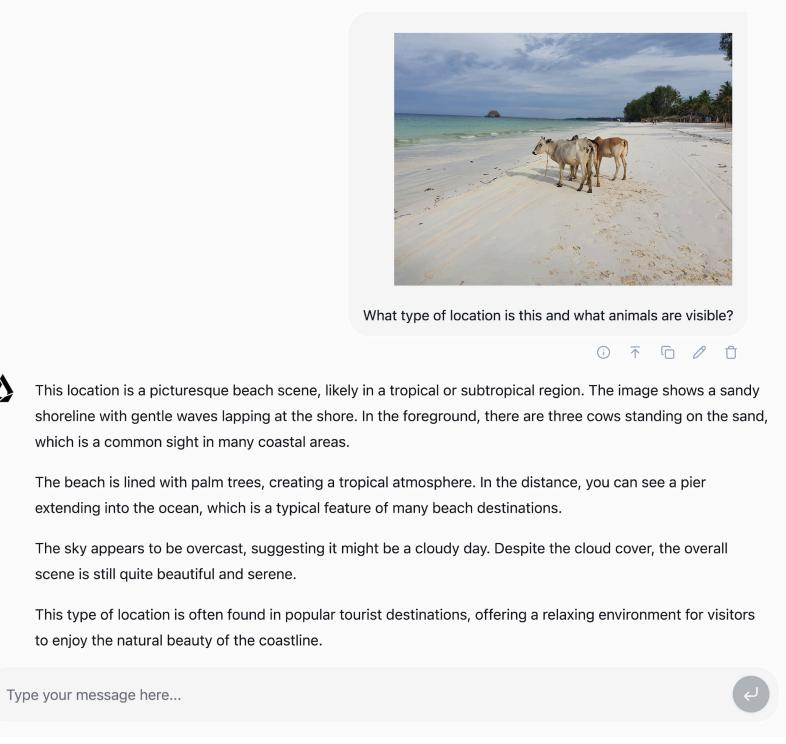
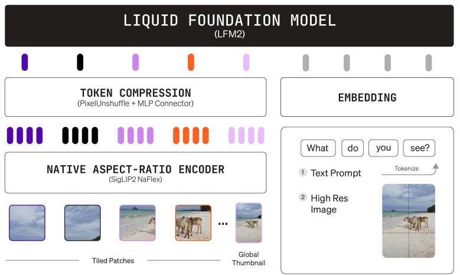
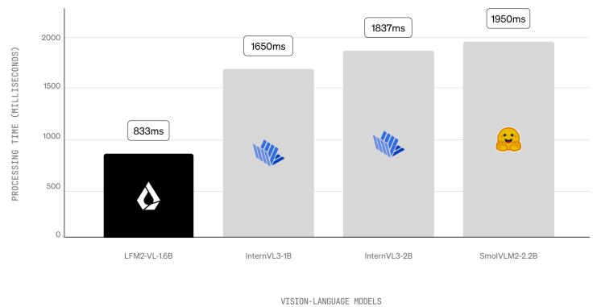
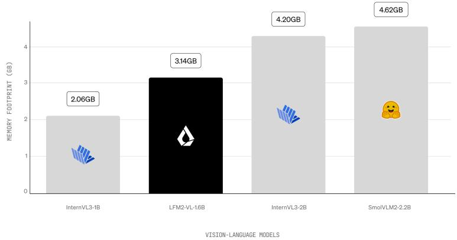

MODELS

# LFM2-VL: EfficientVision-Language Models

AUTHORS Liquid AI PUBLISHED August12, 2025

Today, we release LFM2-VL, ourfirst series of vision-language foundation models. These multimodal models are designed forlow-latency and device-aware deployment. LFM2-VL extends the LFM2 [family](https://www.liquid.ai/blog/liquid-foundation-models-v2-our-second-series-of-generative-ai-models) of open-weight Liquid Foundation Models (LFMs) into the vision-language space, supporting both text and image inputs with variable resolutions.

LFM2-VL offers a practical and versatile solution for various device environments,ranging from phones, laptops, and single-GPU instances to wearables and other embedded devices. Our models achieve great performance on visionlanguage tasks while offering significant efficiency gains, with up to 2x inference speedups on GPU compared to existing models.

LFM2-VL comes in two variants with the hyper-efficient LFM2-VL-450M for highly resource-constrained settings, and the more capable but still lightweight LFM2-VL-1.6B. It offers an efficient solution that is integrated into the open-source

ecosystem, as well as [LEAP](https://leap.liquid.ai/?utm_source=liquid-website&utm_medium=blog-post&utm_campaign=leap&utm_content=general) for customization and multiplatform edge deployment. PRODUCTS SOLUTIONS [RESEARCH](https://www.liquid.ai/research) RESOURCES COMPANRY[equest](https://www.liquid.ai/enterprise-solutions) a Demo

### Highlights on LFM2-VL

- New efficient models based on LFM2: LFM2-VL-450M and LFM2-VL-1.6B, designed forresource-constrained environments
- 2× fasterinference speed on GPUs compared to existing VLMs while maintaining competitive accuracy
- Flexible architecture with user-tunable speed-quality tradeoffs at inference time
- Native resolution processing up to 512×512 with intelligent patch-based handling forlargerimages, avoiding upscaling and distortion

Figure 1. Demo: LFM2-VL-450M identifying a tropical beach with cows on the shore.

#### Architecture

projector.

Figure 2. LFM2-VL architecture and data flow.

Forthe language model tower, LFM2-VL builds upon the LFM2 backbone, inheriting from either LFM2-1.2B (for LFM2- VL-1.6B) or LFM2-350M (for LFM2-VL-450M).

Forthe vision tower, LFM2-VL uses SigLIP2 NaFlex encoders to convert input images into token sequences. Two variants are implemented:

- Shape-optimized (400M) for more fine-grained vision capabilities for LFM2-VL-1.6B
- Base (86M) forfast image processing for LFM2-VL-450M

The encoder processes images at their native resolution up to 512×512 pixels, efficiently handling smallerimages without upscaling and supporting non-standard aspectratios without distortion.

Largerimages are split into non-overlapping square patches of 512×512 each, preserving detail. In LFM2-VL-1.6B, the model also receives a thumbnail (a small, downscaled version of the original image capturing the overall scene) to enhance

global context understanding and alignment. Special tokens

mark each patch's position and indicate the thumbnail's start. PRODUCTS SOLUTIONS [RESEARCH](https://www.liquid.ai/research) RESOURCES COMPANRY[equest](https://www.liquid.ai/enterprise-solutions) a Demo

#### 3/13/26, 11:03 AM LFM2-VL: Efficient Vision-Language Models | Liquid AI

Forthe multimodal projector, we implement a 2-layer MLP connector with pixel unshuffle to reduce image token count. This allowed us to increase throughput without major quality loss. For example, a 256×384 image generates 96 image tokens, a 384×680 image produces 240 tokens, and a 1000×3000 image yields 1,020 tokens.

This flexible architecture enables users to adjust the speedquality tradeoff during inference withoutretraining. Both the maximum number of image tokens (which controls effective inputresolution) and the number of image patches are usertunable, allowing performance optimization for specific use cases and latency requirements.

#### Training

LFM2-VL builds on the LFM2 base model. Vision and language capabilities are then fused during a joint midtraining phase, where the ratio of text to image data is gradually adjusted from 95% to 30%.

This is followed by a joint supervised fine-tuning stage with an emphasis on image understanding. Vision training data comes from a combination of large-scale open-source datasets and in-house synthetic vision datasets, selected to balance coverage across diverse tasks. Overall, LFM2-VL is trained on the order of100 billion multimodal tokens.

#### Evaluation

#### Benchmarks

We evaluate LFM2-VL on several public vision-language benchmarks. The model shows excellent performance in

high-resolution image understanding and multimodal PRODUCTS SOLUTIONS [RESEARCH](https://www.liquid.ai/research) RESOURCES COMPANRY[equest](https://www.liquid.ai/enterprise-solutions) a Demo instruction following, while maintaining strong performance in othertasks.

| Model            | LFM2-VL-1.6B | LFM2-VL 450M | InternVL3-2B | InternV |
|------------------|--------------|-----------------|--------------|---------|
| RealWorldQA      | 65.23        | 52.29           | 65.10        | 57.0    |
| MM-IFEval        | 37.66        | 26.18           | 38.49*       | 31.14   |
| (Val) InfoVQA | 58.68        | 46.51           | 66.10*       | 54.9    |
| OCRBench         | 742          | 655             | 831          | 798     |
| BLINK            | 44.40        | 41.98           | 53.10        | 43.0    |
| MMStar           | 49.53        | 40.87           | 61.10        | 52.3    |
| MMMU(Val)        | 38.44        | 33.11           | 48.70        | 43.2    |
| MathVista        | 51.10        | 44.70           | 57.60        | 46.9    |
| SEEDBench_IMG    | 71.97        | 63.5            | 75.00        | 71.2    |
| MMVet            | 48.07        | 33.76           | 67.00        | 58.7    |
| MME              | 1753.04      | 1239.06         | 2186.40      | 1912.   |
| Text MMLU     | 50.99        | 40.16           | 64.80        | 49.8    |

Table 1. Benchmark results for vision-language evaluations.

*We obtained MM-IFEval and InfoVQA (Val) scores forInternVL3 and SmolVLM2 models using VLMEvalKit.

#### Inference speed

Our models excel in inference speed, achieving the fastest performance among all competitors on GPU. We evaluate LFM2-VL in a typical workload consisting of one 1024x1024

image, paired with a short prompt such as "Describe this image in detail," and generate 100 output tokens, under PRODUCTS SOLUTIONS [RESEARCH](https://www.liquid.ai/research) RESOURCES COMPANRY[equest](https://www.liquid.ai/enterprise-solutions) a Demo 3/13/26, 11:03 AM LFM2-VL: Efficient Vision-Language Models | Liquid AI

default settings for each model. In these conditions, LFM2-VL runs up to 2× fasterthan the fastest comparable model, while delivering competitive accuracy.

Figure 3. Processing time comparison across vision-language models.

Figure 4. Memory footprint (in GB) comparison across vision-language models.

#### Build with LFM2-VL

LFM2-VL models are available today on [Hugging](https://huggingface.co/LiquidAI) Face with example fine-tuning code in [Colab](https://colab.research.google.com/drive/1csXCLwJx7wI7aruudBp6ZIcnqfv8EMYN?usp=sharing). We're releasing them under an open license, which is based on Apache 2.0. Our license allows you to freely use LFM2-VL models for academic and research purposes. You can also use the models commercially if you're a smaller company (under

\$10M revenue). Above this threshold, you should contact us PRODUCTS SOLUTIONS [RESEARCH](https://www.liquid.ai/research) RESOURCES COMPANRY[equest](https://www.liquid.ai/enterprise-solutions) a Demo 3/13/26, 11:03 AM LFM2-VL: Efficient Vision-Language Models | Liquid AI

[(sales@liquid.ai](mailto:sales@liquid.ai)) to obtain a commercial license. You can get more details about ourlicense [here](https://www.liquid.ai/lfm-license).

Since LFM2-VL models are designed for on-device efficiency, we recommend testing them privately and locally on your device. They are currently compatible with Hugging Face transformers and TRL. We are actively working with the community to integrate LFM2-VL into other popularinference and fine-tuning frameworks.

If you are interested in custom solutions with edge deployment, please contact our sales team at [sales@liquid.ai.](mailto:sales@liquid.ai)

READY TO EXPERIENCE AI?

## Power your business, workflows, and engineers with LiquidAI.

Stay up to date with Liquid

Email*

PRODUCTS SOLUTIONS [RESEARCH](https://www.liquid.ai/research) RESOURCES COMPANRY[equest](https://www.liquid.ai/enterprise-solutions) a Demo

| Get Apollo forfree Vibe check LFMs directly on your phone. | Start Up Solutions Automotive Consumer Electronics         | Foundation Press Models LEAP Apollo Research  | Blog Careers Contact Us | Privacy Policy Privacy Choices Terms & Conditions |
|---------------------------------------------------------------------------------------|---------------------------------------------------------------------------|--------------------------------------------------------------|----------------------------------|---------------------------------------------------------------------|
|                                                                                       | Ecommerce Financial Services Healthcare & Life Sciences | Pricing & Licensing DEVELOPER RESOURCES Demos |                                  |                                                                     |
|                                                                                       | Industrial & Robotics Case Studies                            | Documentation Developer Community Hackathons        |                                  |                                                                     |

© 2026, LiquidAI, Inc.Allrights reserved.

314 Main St, Cambridge, MA02142